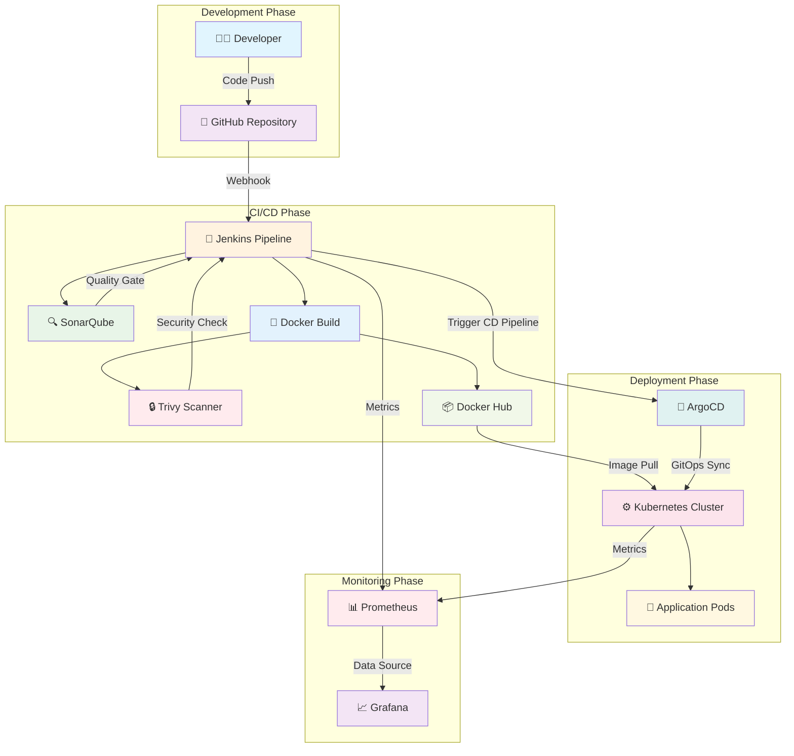
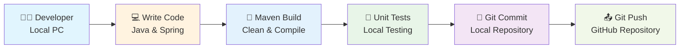
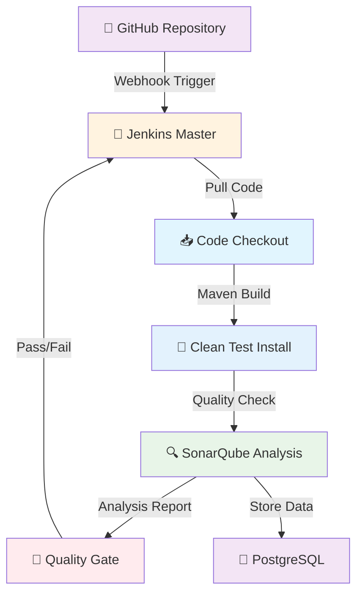
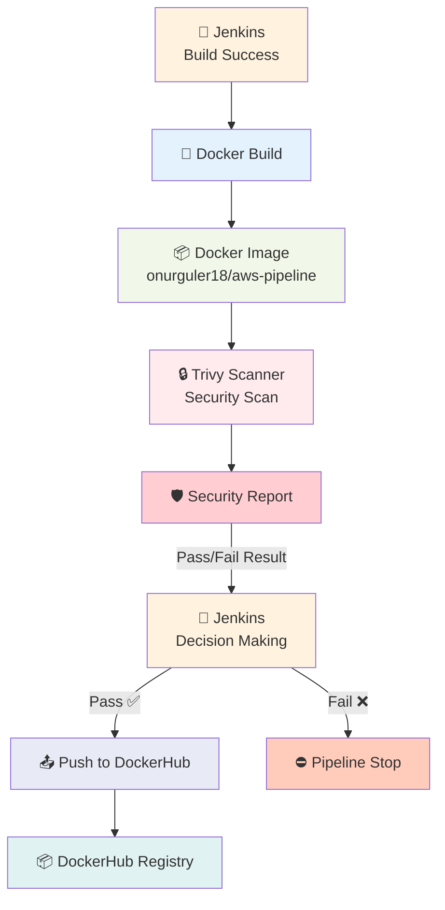
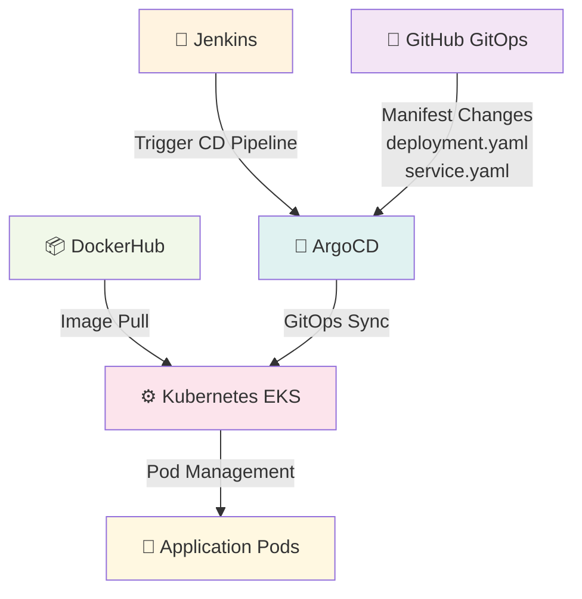
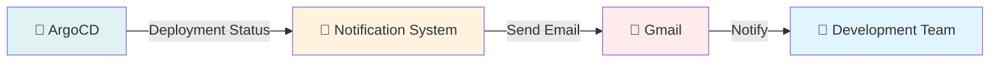
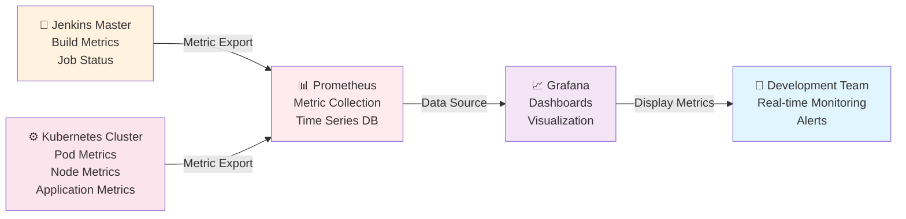
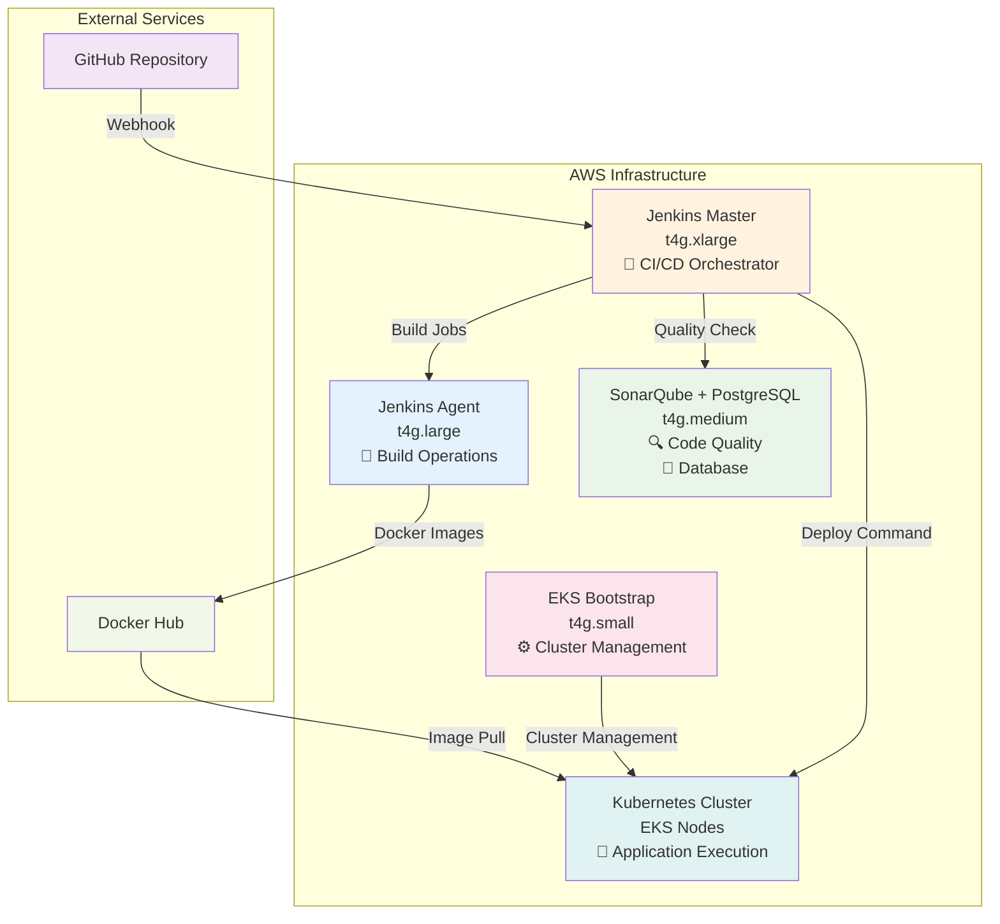

# 🚀 AWS DevOps Pipeline Project

> **🇹🇷 Turkish Version:** [README.md](README.md)

## 📋 Project Summary
This project includes a fully automated CI/CD process for a Spring Boot application using modern DevOps practices. It is developed using Jenkins, Docker, Kubernetes, SonarQube, Trivy, and AWS EKS technologies.

## 🛠️ Technology Stack

| Technology | Version | Description |
|-----------|---------|-------------|
| **Java** | 21 | Backend programming language |
| **Spring Boot** | 3.2.0 | Web framework |
| **Maven** | 3.9+ | Build tool |
| **Docker** | Latest | Containerization |
| **Kubernetes** | 1.28+ | Container orchestration |
| **Jenkins** | 2.400+ | CI/CD automation |
| **SonarQube** | 9.0+ | Code quality analysis |
| **Trivy** | Latest | Security scanning |
| **ArgoCD** | 2.12+ | GitOps continuous deployment |
| **Prometheus** | 2.45+ | Metric collection and monitoring |
| **Grafana** | 10.2+ | Visualization and dashboards |
| **AWS EKS** | 1.28+ | Managed Kubernetes service |

## 🏗️ System Architecture

### **DevOps Pipeline Flow Diagram**


## 📋 DevOps Pipeline Sections

### 1️⃣ Development & Version Control

#### **🎯 Section Purpose**
Developer writes code in their local environment and securely sends it to the central repository.

#### **🔧 Tools Used**
- **Java 21 & Spring Boot**: Main application development
- **Apache Maven**: Build and dependency management
- **Git**: Local version control
- **GitHub**: Central repository

#### **📊 Development Flow Diagram**


#### **🔄 Process Flow**
1. **Developer** writes code with Java & Spring on local PC
2. **Maven** builds and tests the project
3. **Git** commits changes to local repository
4. **GitHub** is updated by pushing to the central repository

---

### 2️⃣ Continuous Integration

#### **🎯 Section Purpose**
Automatically test, build, and perform quality control on code changes from GitHub.

#### **🔧 Tools Used**
- **Jenkins Master**: CI/CD orchestrator
- **SonarQube**: Code quality and security analysis
- **PostgreSQL**: SonarQube data storage

#### **📊 CI Flow Diagram**


#### **🔄 Process Flow**
1. **GitHub** triggers Jenkins via webhook
2. **Jenkins** pulls code and builds with Maven
3. **SonarQube** performs code quality analysis
4. Pipeline continues/stops based on **Quality Gate** result

---

### 3️⃣ Containerization & Security

#### **🎯 Section Purpose**
Convert successful build to container and perform security scanning.

#### **🔧 Tools Used**
- **Docker**: Containerization engine
- **Aqua Trivy**: Security scanning
- **DockerHub**: Container registry

#### **📊 Container & Security Flow Diagram**


#### **🔄 Process Flow**
1. **Jenkins** sends successful build to Docker
2. **Docker** converts application to container image
3. **Trivy** scans image for security vulnerabilities
4. **Security Report** returns `Pass/Fail` result to Jenkins
5. If **Pass**, Jenkins pushes image to DockerHub; if **Fail**, pipeline stops

---

### 4️⃣ Continuous Deployment & GitOps

#### **🎯 Section Purpose**
Automatically deploy containers to production environment and manage with GitOps.

#### **🔧 Tools Used**
- **Kubernetes EKS**: Container orchestration
- **ArgoCD**: GitOps continuous deployment
- **Kubernetes Manifests**: deployment.yaml and service.yaml files

#### **📊 CD & GitOps Flow Diagram**


#### **🔄 Process Flow**
1. **Jenkins** triggers ArgoCD (Trigger CD Pipeline)
2. **ArgoCD** monitors GitOps repository ([aws-pipeline-gitops](https://github.com/onurglr/aws-pipeline-gitops))
3. **ArgoCD** applies Kubernetes manifest files (deployment.yaml, service.yaml) to Kubernetes
4. **Kubernetes** pulls image from DockerHub and creates pods
5. **Application Pods** start running

---

### 5️⃣ Notification

#### **🎯 Section Purpose**
Send notifications about system status and deployment results.

#### **🔧 Tools Used**
- **Gmail**: Email notification system

#### **📊 Notification Flow Diagram**


#### **🔄 Process Flow**
1. **ArgoCD** monitors deployment status
2. **Notification System** prepares email
3. **Gmail** sends notification to team

---

### 6️⃣ Monitoring

#### **🎯 Section Purpose**
Collect and visualize system and application metrics to provide real-time monitoring.

#### **🔧 Tools Used**
- **Prometheus**: Metric collection and time-series database
- **Grafana**: Metric visualization and dashboards

#### **📊 Monitoring Flow Diagram**


#### **🔄 Process Flow**
1. **Jenkins Master** and **Kubernetes Cluster** export metrics
2. **Prometheus** collects metrics and stores them in time-series database
3. **Grafana** uses Prometheus as data source and creates dashboards
4. **Development Team** performs real-time monitoring via Grafana and views alerts

---

### 🔍 Detailed Process Diagrams

For detailed process diagrams and integration details of each DevOps tool:

👉 See the **[Detailed DevOps Diagrams](detailed-devops-diagrams-en.md)** file

In this file you will find:
- 🚀 **Jenkins Detailed Pipeline Process**
- 🐳 **Docker Detailed Build Process** 
- ⚙️ **Kubernetes Detailed Deployment Process**
- 🔍 **SonarQube Detailed Analysis Process**
- 🔒 **Trivy Detailed Security Scanning Process**
- 🔄 **ArgoCD Detailed GitOps Process**
- 🔄 **Pipeline Fail Scenarios**
- 🌐 **GitHub Detailed Process Diagram**

## 📁 Project Structure

```
aws-pipeline/
├── src/
│   ├── main/
│   │   ├── java/com/onurguler/
│   │   │   ├── AppMain.java              # Spring Boot main class
│   │   │   └── controller/
│   │   │       └── DevOpsController.java # REST API endpoints
│   │   └── resources/
│   │       └── application.properties    # Application configuration
│   └── test/                             # Test classes
├── target/                               # Build artifacts
├── Dockerfile                           # Docker configuration
├── deployment.yaml                      # K8s deployment
├── service.yaml                         # K8s service
├── Jenkinsfile                          # CI/CD process
├── pom.xml                             # Maven configuration
└── README.md                           # Project documentation
```

## 🏗️ Infrastructure Setup

### 🖥️ Machine Architecture

| Machine | Instance Type | vCPU | RAM | Storage | Task |
|---------|---------------|------|-----|---------|------|
| Jenkins Master | t4g.xlarge | 4 | 16GB | 15GB | Main CI/CD orchestrator |
| Jenkins Agent | t4g.large | 2 | 8GB | 15GB | Build operations |
| SonarQube | t4g.medium | 2 | 4GB | 15GB | Code quality analysis |
| EKS Bootstrap | t4g.small | 2 | 2GB | 15GB | Cluster management |
| EKS Worker Nodes | t4g.medium | 2 | 4GB | 15GB | Worker nodes running pods |

### 🔗 Machine Communication Diagram



### 📋 Setup Summary

#### 🚀 Jenkins Master (t4g.xlarge)
- **Java 21 + Maven** installation
- **Jenkins** service and plugins
- **GitHub webhook** integration
- **Agent connection** setup

#### 🔌 Required Jenkins Plugins (To be installed on Jenkins Master)
- **Git Plugin** - Git repository integration
- **GitHub Plugin** - GitHub webhook and integration
- **Maven Integration Plugin** - Maven build support
- **Docker Plugin** - Docker build and push operations
- **Kubernetes Plugin** - Kubernetes deployment support
- **SonarQube Scanner Plugin** - Code quality analysis
- **Trivy Plugin** - Security scanning
- **Blue Ocean** - Modern pipeline visualization
- **Pipeline Stage View Plugin** - Detailed stage viewing
- **Build Timeout Plugin** - Build timeout control

> **Note:** All plugins are installed on Jenkins Master. Agents use Master's plugins and execute build operations.

#### 🔨 Jenkins Agent (t4g.large)
- **Java 21 + Maven** installation
- **Docker** engine and Docker Hub auth
- **Maintenance scripts** (cleanup automation)

#### 🔍 SonarQube (t4g.medium)
- **Java 11** installation (SonarQube requirement)
- **PostgreSQL** database installation
- **SonarQube** service and configuration

#### ⚙️ EKS Bootstrap (t4g.small)
- **AWS CLI + kubectl + eksctl** installation
- **EKS cluster** creation (my-workspace-cluster)
- **ArgoCD** deployment and LoadBalancer setup

## 🚀 Application Deployment

### 📦 Basic Deployment
- Git repository cloning and Maven build process
- Docker image creation and container deployment
- Kubernetes deployment and service configuration

## 🌐 API Endpoints

| Endpoint | Method | Description |
|----------|--------|-------------|
| `/` | GET | Home page - Welcome message |
| `/info` | GET | Application information |
| `/about` | GET | About information |

### Example Response
```json
{
  "message": "Version3 Hi Hello: 2024-01-15T10:30:45.123",
  "timestamp": "2024-01-15T10:30:45.123"
}
```

## ⚙️ DevOps Configuration Details

### 🔧 Jenkins Configuration

#### Pipeline Settings
- **Pipeline Type**: Declarative pipeline syntax
- **Build Triggers**: GitHub webhook and SCM polling
- **Agent Label**: `My-Jenkins-Agent`
- **Tools**: Maven3, Java21

#### Credential Management (Jenkins Master → Manage Jenkins → Credentials)
- **`dockerhub`** (Secret text): DockerHub Personal Access Token
  - Usage: Docker image push operations
  - In Pipeline: `DOCKER_LOGIN = 'dockerhub'`
- **`jenkins-sonar-token`** (Secret text): SonarQube token
  - Usage: SonarQube analysis and quality gate check
  - In Pipeline: `credentialsId: 'jenkins-sonar-token'`
- **`JENKINS_API_TOKEN`** (Secret text): Jenkins API token
  - Usage: To trigger ArgoCD CD pipeline
  - In Pipeline: `credentials("JENKINS_API_TOKEN")`

#### Environment Variables
```groovy
APP_NAME = "aws-pipeline"
RELEASE = "1.0"
DOCKER_USER = "onurguler18"
IMAGE_NAME = "onurguler18/aws-pipeline"
IMAGE_TAG = "1.0.${BUILD_NUMBER}"
```

### 🐳 Docker Configuration
- **Registry**: DockerHub (`onurguler18/aws-pipeline`)
- **Build**: Multi-stage build (Dockerfile)
- **Image Tagging**: `latest` and version tag (`1.0.${BUILD_NUMBER}`)
- **Security**: Security vulnerability check with Trivy scan

### ⚙️ Kubernetes Configuration
- **Deployment**: `deployment.yaml` (3 replicas, rolling update)
- **Service**: `service.yaml` (LoadBalancer)
- **Resources**: 
  - Requests: 256Mi memory, 250m CPU
  - Limits: 512Mi memory, 500m CPU
- **Image**: `onurguler18/aws-pipeline:latest`

### 🔍 SonarQube Configuration
- **Project Key**: `aws-pipeline`
- **Quality Gate**: Coverage >80%, Security Rating A
- **Integration**: Automatic analysis with Jenkins pipeline
- **Database**: PostgreSQL (on same VM)

### 🔄 ArgoCD Configuration
- **GitOps Repository**: [aws-pipeline-gitops](https://github.com/onurglr/aws-pipeline-gitops)
- **Application Name**: `devops-application`
- **Sync Policy**: Automatic synchronization
- **Trigger**: Triggered from `Trigger CD Pipeline` stage with Jenkins API token

### 📊 Monitoring Configuration
- **Prometheus**: Jenkins and Kubernetes metric collection
- **Grafana**: Metric visualization and dashboards
- **Targets**: Jenkins Master, Kubernetes cluster, Application pods

## 📚 Resources

- [Spring Boot Documentation](https://spring.io/projects/spring-boot)
- [Docker Documentation](https://docs.docker.com/)
- [Kubernetes Documentation](https://kubernetes.io/docs/)
- [Jenkins Documentation](https://www.jenkins.io/doc/)
- [SonarQube Documentation](https://docs.sonarqube.org/)
- [Trivy Documentation](https://aquasecurity.github.io/trivy/)

## 🤝 Contributing

- Fork and create a feature branch
- Commit and push your changes
- Create a Pull Request

## 📄 License

This project is licensed under the MIT License. See the [LICENSE](LICENSE) file for details.

## 👨‍💻 Developer

**Onur Güler**
- GitHub: [@onurglr](https://github.com/onurglr)
- LinkedIn: [Onur Güler](https://linkedin.com/in/onurguler-dev)

---

## 🎯 Project Goals

This project is designed to achieve the following DevOps goals:

- ✅ **Automated CI/CD Pipeline**
- ✅ **Container Orchestration**
- ✅ **Code Quality Management**
- ✅ **Security Scanning**
- ✅ **Infrastructure as Code**
- ✅ **Monitoring & Logging**
- ✅ **Scalable Architecture**

---

