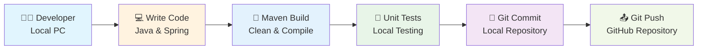
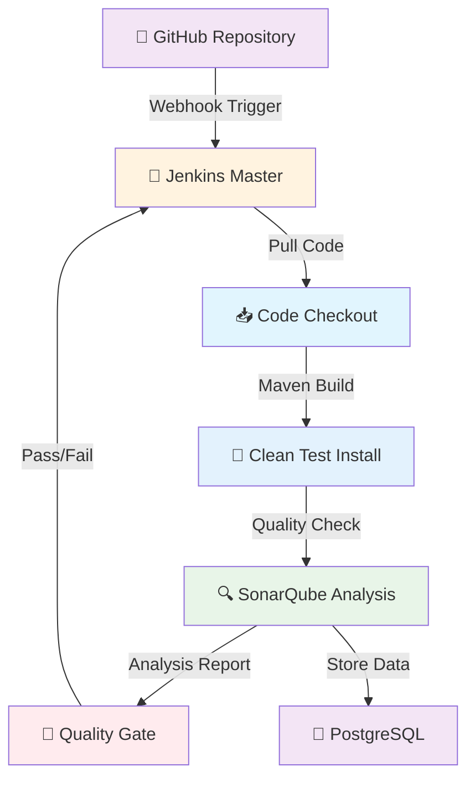
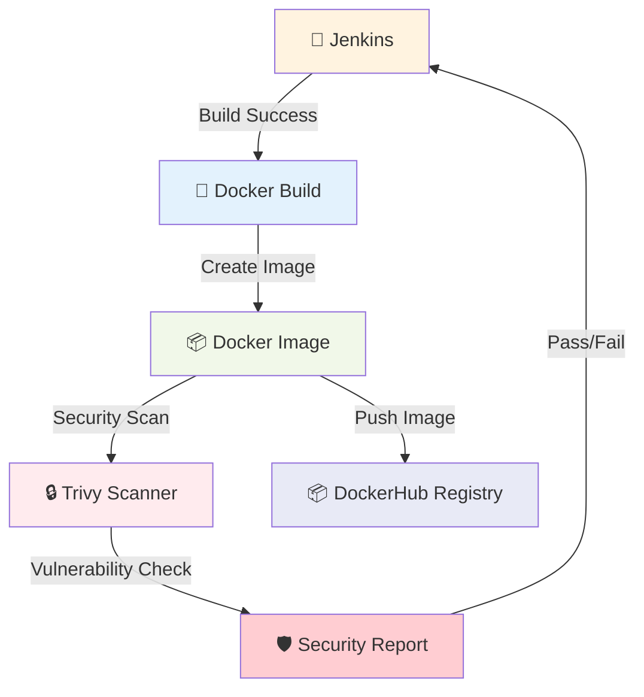
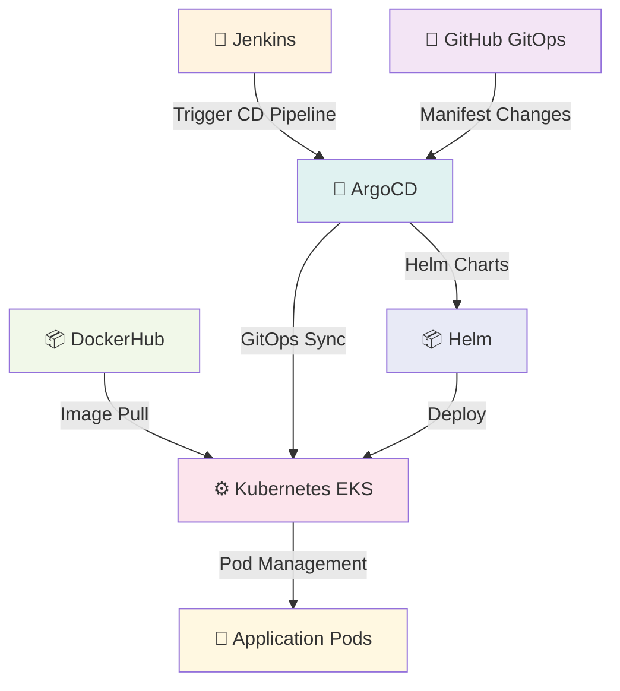
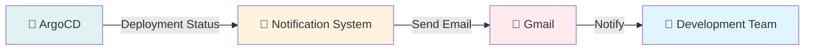
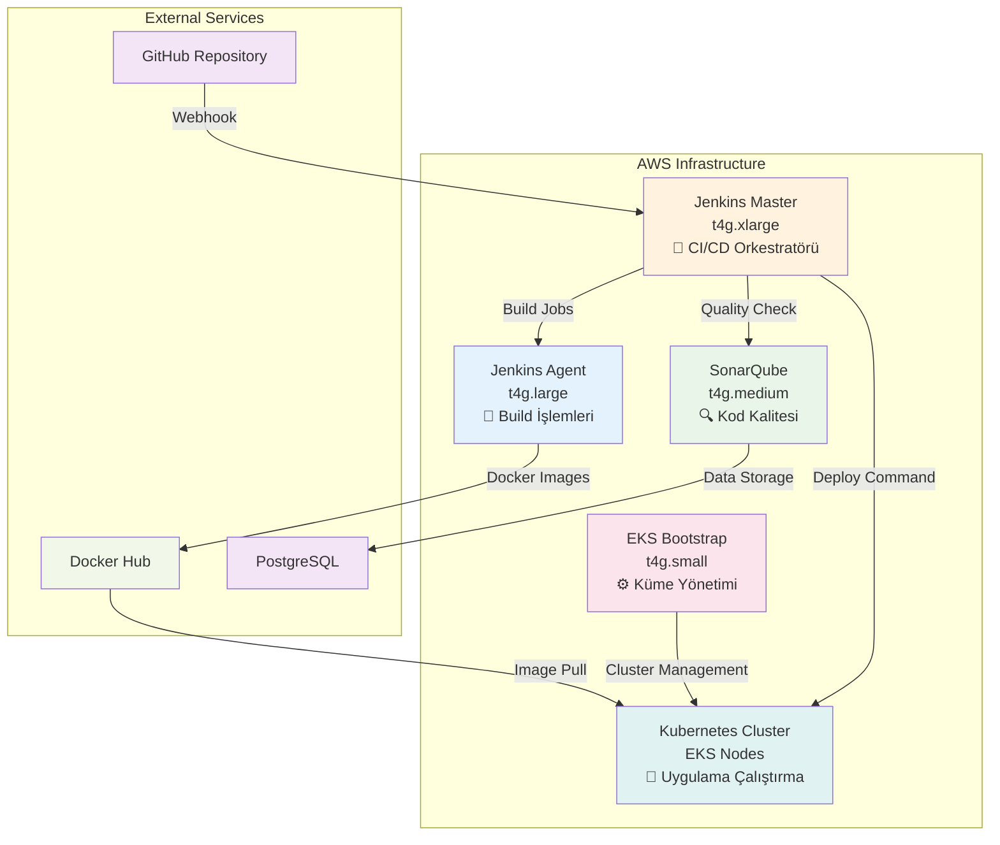

# 🚀 AWS DevOps Pipeline Projesi

## 📋 Proje Özeti
Bu proje, modern DevOps uygulamalarını kullanarak Spring Boot uygulamasının tam otomatik CI/CD sürecini içerir. Jenkins, Docker, Kubernetes, SonarQube, Trivy ve AWS EKS teknolojileri kullanılarak geliştirilmiştir.

## 🛠️ Teknoloji Yığını

| Teknoloji | Versiyon | Açıklama |
|-----------|----------|----------|
| **Java** | 21 | Backend programlama dili |
| **Spring Boot** | 3.2.0 | Web çatısı |
| **Maven** | 3.9+ | Derleme aracı |
| **Docker** | En Son | Kapsayıcılaştırma |
| **Kubernetes** | 1.28+ | Kapsayıcı orkestrasyonu |
| **Jenkins** | 2.400+ | CI/CD otomasyonu |
| **SonarQube** | 9.0+ | Kod kalitesi analizi |
| **Trivy** | En Son | Güvenlik taraması |
| **ArgoCD** | 2.12+ | GitOps sürekli dağıtım |
| **Helm** | 3.12+ | Kubernetes paket yöneticisi |
| **Prometheus** | 2.45+ | Metrik toplama ve izleme |
| **Grafana** | 10.2+ | Görselleştirme ve dashboard |
| **AWS EKS** | 1.28+ | Yönetilen Kubernetes servisi |

## 🏗️ Sistem Mimarisi

### **DevOps Pipeline Akış Diyagramı**


## 📋 DevOps Pipeline Bölümleri

### 1️⃣ Development & Version Control

#### **🎯 Bölüm Amacı**
Geliştiricinin yerel ortamında kod yazması ve merkezi repository'ye güvenli şekilde göndermesi.

#### **🔧 Kullanılan Araçlar**
- **Java 21 & Spring Boot**: Ana uygulama geliştirme
- **Apache Maven**: Build ve dependency management
- **Git**: Local version control
- **GitHub**: Central repository

#### **📊 Development Workflow**


#### **🔄 Süreç Akışı**
1. **Developer** yerel PC'de Java & Spring ile kod yazar
2. **Maven** ile projeyi build eder ve test eder
3. **Git** ile değişiklikleri local repository'ye commit eder
4. **GitHub**'a push yaparak merkezi repository'yi günceller

---

### 2️⃣ Continuous Integration

#### **🎯 Bölüm Amacı**
GitHub'dan gelen kod değişikliklerini otomatik olarak test etmek, build etmek ve kalite kontrolü yapmak.

#### **🔧 Kullanılan Araçlar**
- **Jenkins Master**: CI/CD orkestratörü
- **SonarQube**: Kod kalitesi ve güvenlik analizi
- **PostgreSQL**: SonarQube veri depolama

#### **📊 CI Workflow**


#### **🔄 Süreç Akışı**
1. **GitHub** webhook ile Jenkins'i tetikler
2. **Jenkins** kodu çeker ve Maven ile build eder
3. **SonarQube** kod kalitesi analizi yapar
4. **Quality Gate** sonucuna göre pipeline devam eder/durur

---

### 3️⃣ Containerization & Security

#### **🎯 Bölüm Amacı**
Başarılı build'i container'a dönüştürmek ve güvenlik taraması yapmak.

#### **🔧 Kullanılan Araçlar**
- **Docker**: Containerization engine
- **Aqua Trivy**: Security scanning
- **DockerHub**: Container registry

#### **📊 Container & Security Workflow**


#### **🔄 Süreç Akışı**
1. **Jenkins** başarılı build'i Docker'a gönderir
2. **Docker** uygulamayı container image'ına dönüştürür
3. **Trivy** image'ı güvenlik açıkları için tarar
4. **DockerHub**'a güvenli image push edilir

---

### 4️⃣ Continuous Deployment & GitOps

#### **🎯 Bölüm Amacı**
Container'ları production ortamına otomatik olarak deploy etmek ve GitOps ile yönetmek.

#### **🔧 Kullanılan Araçlar**
- **Kubernetes EKS**: Container orchestration
- **ArgoCD**: GitOps continuous deployment
- **Helm**: Kubernetes package management

#### **📊 CD & GitOps Workflow**


#### **🔄 Süreç Akışı**
1. **Jenkins** ArgoCD'yi tetikler (Trigger CD Pipeline)
2. **ArgoCD** GitOps repository'yi izler
3. **Kubernetes** DockerHub'dan image'ı çeker
4. **Helm** ile Kubernetes'e deploy edilir
5. **Application Pods** çalışmaya başlar

---

### 5️⃣ Notification

#### **🎯 Bölüm Amacı**
Sistem durumu ve deployment sonuçları hakkında bildirim göndermek.

#### **🔧 Kullanılan Araçlar**
- **Gmail**: Email notification system

#### **📊 Notification Workflow**


#### **🔄 Süreç Akışı**
1. **ArgoCD** deployment durumunu izler
2. **Notification System** email hazırlar
3. **Gmail** ile team'e bildirim gönderir

### 🔍 Detaylı Süreç Diyagramları

Her DevOps aracının detaylı süreç diyagramları ve entegrasyon detayları için:

👉 **[Detaylı DevOps Diyagramları](detailed-devops-diagrams.md)** dosyasına bakın

Bu dosyada şunları bulacaksınız:
- 🚀 **Jenkins Detaylı Pipeline Süreci**
- 🐳 **Docker Detaylı Build Süreci** 
- ⚙️ **Kubernetes Detaylı Deployment Süreci**
- 🔍 **SonarQube Detaylı Analiz Süreci**
- 🔒 **Trivy Detaylı Güvenlik Tarama Süreci**
- 🔄 **ArgoCD Detaylı GitOps Süreci**
- 🔄 **Pipeline Fail Scenarios**
- 🌐 **GitHub Detaylı Süreç Diyagramı**

## 📁 Proje Yapısı

```
aws-pipeline/
├── src/
│   ├── main/
│   │   ├── java/com/onurguler/
│   │   │   ├── AppMain.java              # Spring Boot ana sınıf
│   │   │   └── controller/
│   │   │       └── DevOpsController.java # REST API uç noktaları
│   │   └── resources/
│   │       └── application.properties    # Uygulama yapılandırması
│   └── test/                             # Test sınıfları
├── target/                               # Derleme eserleri
├── Dockerfile                           # Docker yapılandırması
├── deployment.yaml                      # K8s dağıtımı
├── service.yaml                         # K8s servisi
├── Jenkinsfile                          # CI/CD süreci
├── pom.xml                             # Maven yapılandırması
└── README.md                           # Proje dokümantasyonu
```

## 🏗️ Altyapı Kurulumu

### 🖥️ Makine Mimarisi

| Makine | Örnek Türü | vCPU | RAM | Depolama | Görev |
|--------|-------------|------|-----|----------|-------|
| Jenkins Master | t4g.xlarge | 4 | 16GB | 15GB | Ana CI/CD orkestratörü |
| Jenkins Agent | t4g.large | 2 | 8GB | 15GB | Build işlemleri |
| SonarQube | t4g.medium | 2 | 4GB | 15GB | Kod kalitesi analizi |
| EKS Bootstrap | t4g.small | 2 | 2GB | 15GB | Küme yönetimi |

### 🔗 Makine İletişim Diyagramı



### 📋 Kurulum Özeti

#### 🚀 Jenkins Master (t4g.xlarge)
- **Java 21 + Maven** kurulumu
- **Jenkins** servisi ve plugin'leri
- **GitHub webhook** entegrasyonu
- **Agent bağlantısı** kurulumu

#### 🔌 Gerekli Jenkins Plugin'leri
- **Git Plugin** - Git repository entegrasyonu
- **GitHub Plugin** - GitHub webhook ve entegrasyonu
- **Maven Integration Plugin** - Maven build desteği
- **Docker Plugin** - Docker build ve push işlemleri
- **Kubernetes Plugin** - Kubernetes deployment desteği
- **SonarQube Scanner Plugin** - Kod kalitesi analizi
- **Trivy Plugin** - Güvenlik taraması
- **Blue Ocean** - Modern pipeline görselleştirme
- **Pipeline Stage View Plugin** - Stage detaylı görüntüleme
- **Build Timeout Plugin** - Build timeout kontrolü
- **Credentials Plugin** - Güvenli credential yönetimi

#### 🔨 Jenkins Agent (t4g.large)
- **Java 21 + Maven** kurulumu
- **Docker** engine ve Docker Hub auth
- **Maintenance scripts** (temizlik otomasyonu)

#### 🔍 SonarQube (t4g.medium)
- **Java 11** kurulumu (SonarQube requirement)
- **PostgreSQL** database kurulumu
- **SonarQube** servisi ve konfigürasyonu

#### ⚙️ EKS Bootstrap (t4g.small)
- **AWS CLI + kubectl + eksctl** kurulumu
- **EKS cluster** oluşturma (my-workspace-cluster)
- **ArgoCD** deployment ve LoadBalancer setup

## 🚀 Application Deployment

### 📦 Temel Dağıtım
- Git repository cloning ve Maven build process
- Docker image building ve container deployment
- Kubernetes deployment ve service configuration

## 🌐 API Uç Noktaları

| Endpoint | Method | Açıklama |
|----------|--------|----------|
| `/` | GET | Ana sayfa - Hoş geldin mesajı |
| `/info` | GET | Uygulama bilgileri |
| `/about` | GET | Hakkında bilgisi |

### Örnek Yanıt
```json
{
  "message": "Version3 Hi Hello: 2024-01-15T10:30:45.123",
  "timestamp": "2024-01-15T10:30:45.123"
}
```

## ⚙️ DevOps Konfigürasyon Detayları

### 🔧 Jenkins Konfigürasyonu
- **Pipeline Script**: Declarative pipeline syntax ile CI/CD otomasyonu
- **Build Triggers**: GitHub webhook ve SCM polling konfigürasyonu
- **Environment Variables**: Build environment ve credential yönetimi
- **Plugin Installation**: Docker, Kubernetes, SonarQube, Trivy, Git, Maven plugin'leri

### 🐳 Docker Konfigürasyonu
- **Multi-stage Build**: Production-ready image oluşturma
- **Security Scanning**: Container güvenlik taraması ve vulnerability check
- **Image Optimization**: Layer caching ve boyut optimizasyonu
- **Registry Integration**: DockerHub authentication ve push automation

### ⚙️ Kubernetes Konfigürasyonu
- **Deployment Strategy**: Rolling update ve zero-downtime deployment
- **Resource Management**: CPU ve memory limits ile resource optimization
- **Health Checks**: Liveness ve readiness probe konfigürasyonu
- **Service Mesh**: Load balancing ve service discovery

### 🔍 SonarQube Konfigürasyonu
- **Quality Gates**: Kod kalitesi kriterleri ve threshold ayarları
- **Code Coverage**: Test coverage requirements ve reporting
- **Security Rules**: Güvenlik kuralları ve vulnerability detection
- **Integration**: Jenkins pipeline ile otomatik quality gate kontrolü

### 🔄 ArgoCD Konfigürasyonu
- **GitOps Workflow**: Git-based deployment ve configuration management
- **Sync Policies**: Otomatik sync ve manual approval workflows
- **Application Monitoring**: Deployment status ve health monitoring
- **Rollback Capabilities**: Hızlı rollback ve version management
- **GitOps Repository**: [aws-pipeline-gitops](https://github.com/onurglr/aws-pipeline-gitops) repository'sini ArgoCD'ye bağlama

### 📊 Monitoring Konfigürasyonu
- **Metrics Collection**: Application ve infrastructure metrics
- **Log Aggregation**: Centralized logging ve log analysis
- **Alerting Rules**: Threshold-based alerting ve notification
- **Dashboard Configuration**: Real-time monitoring ve visualization

## 📊 İzleme ve Günlük Tutma

### 🔧 Jenkins İzleme
- Build status API integration ve console output monitoring
- Jenkins log tracking ve system log configuration
- Disk usage monitoring ve build artifact cleanup

### ⚙️ Kubernetes İzleme
- Pod status monitoring ve detailed pod inspection
- Service status tracking ve cluster health checks
- Real-time log monitoring ve log rotation setup

### 🔍 SonarQube İzleme
- System status API integration ve web interface monitoring
- SonarQube log tracking ve administration configuration
- PostgreSQL database status ve size monitoring

### 🔄 ArgoCD İzleme
- Application status tracking ve sync monitoring
- ArgoCD server ve application controller log monitoring
- Application history ve sync validation

## 🔒 Güvenlik

### Güvenlik Taraması
- **Trivy**: Container image güvenlik taraması
- **SonarQube**: Kod kalitesi ve güvenlik analizi
- **Docker**: Multi-stage build ile güvenli image oluşturma

### En İyi Uygulamalar
- Container image'ları güncel base image'larla oluşturma
- Resource limits tanımlama
- Security scanning'i pipeline'a entegre etme
- Secrets management

## 🚀 Dağıtım Stratejisi

### Rolling Update
```bash
# Yeni versiyonu deploy et
kubectl set image deployment/devops-application-deployment devops-application=onurguler18/devops-application:1.0.123

# Rollout durumunu kontrol et
kubectl rollout status deployment/devops-application-deployment

# Rollback (gerekirse)
kubectl rollout undo deployment/devops-application-deployment
```

## 📈 Performans ve Ölçeklendirme

### Kaynak Yönetimi (t4g.xlarge optimize edilmiş)
```yaml
resources:
  requests:
    memory: "256Mi"
    cpu: "250m"
  limits:
    memory: "512Mi"
    cpu: "500m"
```

### Otomatik Ölçeklendirme
```yaml
apiVersion: autoscaling/v2
kind: HorizontalPodAutoscaler
metadata:
  name: devops-application-hpa
spec:
  scaleTargetRef:
    apiVersion: apps/v1
    kind: Deployment
    name: devops-application-deployment
  minReplicas: 2
  maxReplicas: 10
  metrics:
  - type: Resource
    resource:
      name: cpu
      target:
        type: Utilization
        averageUtilization: 70
```

## 📚 Kaynaklar

- [Spring Boot Dokümantasyonu](https://spring.io/projects/spring-boot)
- [Docker Dokümantasyonu](https://docs.docker.com/)
- [Kubernetes Dokümantasyonu](https://kubernetes.io/docs/)
- [Jenkins Dokümantasyonu](https://www.jenkins.io/doc/)
- [SonarQube Dokümantasyonu](https://docs.sonarqube.org/)
- [Trivy Dokümantasyonu](https://aquasecurity.github.io/trivy/)

## 🤝 Katkıda Bulunma

- Fork yapın ve feature branch oluşturun
- Değişikliklerinizi commit edin ve push edin
- Pull Request oluşturun

## 📄 Lisans

Bu proje MIT lisansı altında lisanslanmıştır. Detaylar için [LICENSE](LICENSE) dosyasına bakın.

## 👨‍💻 Geliştirici

**Onur Güler**
- GitHub: [@onurglr](https://github.com/onurglr)
- LinkedIn: [Onur Güler](https://linkedin.com/in/onurguler-dev)

---

## 🎯 Proje Hedefleri

Bu proje aşağıdaki DevOps hedeflerini gerçekleştirmek için tasarlanmıştır:

- ✅ **Otomatik CI/CD Pipeline**
- ✅ **Container Orchestration**
- ✅ **Code Quality Management**
- ✅ **Security Scanning**
- ✅ **Infrastructure as Code**
- ✅ **Monitoring & Logging**
- ✅ **Scalable Architecture**

---

