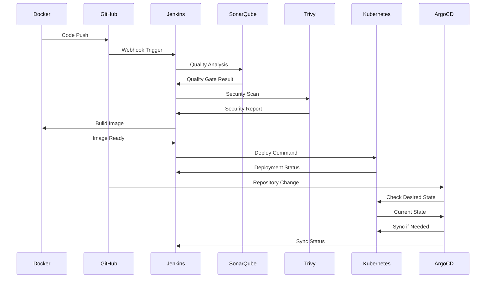

# 🚀 AWS DevOps Pipeline Projesi

## 📋 Proje Özeti
Bu proje, modern DevOps uygulamalarını kullanarak Spring Boot uygulamasının tam otomatik CI/CD sürecini içerir. Jenkins, Docker, Kubernetes, SonarQube, Trivy ve AWS EKS teknolojileri kullanılarak geliştirilmiştir.

## 🛠️ Teknoloji Yığını

| Teknoloji | Versiyon | Açıklama |
|-----------|----------|----------|
| **Java** | 21 | Backend programlama dili |
| **Spring Boot** | 3.2.0 | Web çatısı |
| **Maven** | 3.9+ | Derleme aracı |
| **Docker** | En Son | Kapsayıcılaştırma |
| **Kubernetes** | 1.28+ | Kapsayıcı orkestrasyonu |
| **Jenkins** | 2.400+ | CI/CD otomasyonu |
| **SonarQube** | 9.0+ | Kod kalitesi analizi |
| **Trivy** | En Son | Güvenlik taraması |
| **AWS EKS** | 1.28+ | Yönetilen Kubernetes servisi |

## 🏗️ Sistem Mimarisi

### **DevOps Pipeline Akış Diyagramı**

```mermaid
graph TB
    subgraph "Development Phase"
        Dev[👨‍💻 Developer]
        GH[📁 GitHub Repository]
        Dev -->|Code Push| GH
    end
    
    subgraph "CI/CD Phase"
        J[🚀 Jenkins Pipeline]
        SQ[🔍 SonarQube]
        D[🐳 Docker Build]
        T[🔒 Trivy Scanner]
        DH[📦 Docker Hub]
        
        GH -->|Webhook| J
        J --> SQ
        J --> D
        D --> T
        D --> DH
        SQ -->|Quality Gate| J
        T -->|Security Check| J
    end
    
    subgraph "Deployment Phase"
        A[🔄 ArgoCD]
        K[⚙️ Kubernetes Cluster]
        App[🏃 Application Pods]
        
        J -->|Deploy Command| A
        DH -->|Image Pull| K
        A -->|GitOps Sync| K
        K --> App
    end
    
    subgraph "Monitoring Phase"
        P[📊 Prometheus]
        G[📈 Grafana]
        J -->|Metrics| P
        K -->|Metrics| P
        P -->|Data Source| G
    end
    
    style Dev fill:#e1f5fe
    style GH fill:#f3e5f5
    style J fill:#fff3e0
    style SQ fill:#e8f5e8
    style T fill:#ffebee
    style D fill:#e3f2fd
    style DH fill:#f1f8e9
    style A fill:#e0f2f1
    style K fill:#fce4ec
    style App fill:#fff8e1
    style P fill:#ffebee
    style G fill:#f3e5f5
```


## 🛠️ DevOps Araçları ve İhtiyaçları

### 🤔 Neden Bu Araçlara İhtiyacımız Var?

#### 🚀 **Jenkins - CI/CD Orkestratörü**
**Neden Gerekli:**
- Manuel deployment hataları ve insan kaynaklı gecikmeleri önler
- Kod kalitesi kontrolü yaparak production'a hatalı kod gönderilmesini engeller
- Otomatik test süreçleri ile sürekli entegrasyon sağlar
- Tekrarlanabilir build süreçleri oluşturur

**Ne İşe Yarar:**
- GitHub'dan kod değişikliklerini algılar ve otomatik build başlatır
- Test, build, quality check, security scan süreçlerini koordine eder
- Docker image oluşturur ve registry'ye push eder
- Kubernetes deployment'ını tetikler

#### 🐳 **Docker - Kapsayıcılaştırma**
**Neden Gerekli:**
- "Benim makinemde çalışıyor" problemini çözer
- Farklı ortamlarda (dev, test, prod) aynı sonuçları garantiler
- Dependency hell problemini ortadan kaldırır
- Mikroservis mimarisi için gerekli izolasyonu sağlar

**Ne İşe Yarar:**
- Uygulamayı tüm bağımlılıklarıyla birlikte paketler
- Taşınabilir ve ölçeklenebilir container'lar oluşturur
- Resource kullanımını optimize eder
- Hızlı deployment ve rollback imkanı sağlar

#### ⚙️ **Kubernetes - Kapsayıcı Orkestrasyonu**
**Neden Gerekli:**
- Çok sayıda container'ı manuel yönetmek imkansız
- High availability ve fault tolerance gereksinimi
- Otomatik scaling ve load balancing ihtiyacı
- Service discovery ve network yönetimi karmaşıklığı

**Ne İşe Yarar:**
- Container'ları otomatik olarak yönetir ve ölçeklendirir
- Pod health check'leri yapar ve otomatik recovery sağlar
- Service mesh ile network trafiğini yönetir
- Rolling update ile zero-downtime deployment yapar

#### 🔍 **SonarQube - Kod Kalitesi Yönetimi**
**Neden Gerekli:**
- Kod kalitesi standartlarını korumak
- Security vulnerability'lerin erken tespiti
- Code smell'lerin ve bug'ların önlenmesi
- Technical debt'in kontrol altında tutulması

**Ne İşe Yarar:**
- Kod kalitesi metriklerini sürekli izler
- Quality gate ile kalite standartlarını zorunlu kılar
- Security hotspot'ları tespit eder
- Code coverage ve duplication analizi yapar

#### 🔒 **Trivy - Güvenlik Taraması**
**Neden Gerekli:**
- Container image'larındaki güvenlik açıklarını tespit etmek
- Production'a güvenli olmayan image'ların gönderilmesini önlemek
- Compliance gereksinimlerini karşılamak
- Zero-day vulnerability'lerin takibi

**Ne İşe Yarar:**
- Container image'larını güvenlik açıklarına karşı tarar
- CVE database'ini kullanarak vulnerability'leri tespit eder
- HIGH ve CRITICAL seviye açıklar için build'i durdurur
- Güvenlik raporları oluşturur

##### **Trivy'nin Ana Bağlantıları:**

**🔗 Jenkins Pipeline Bağlantısı:**
- **Security Scanner Integration**: Container güvenlik taraması yapar
- **Vulnerability Database**: CVE database ile güvenlik açıklarını tespit eder
- **Report Processing**: Güvenlik raporlarını analiz eder
- **Build Control**: Güvenlik açığı durumuna göre build'i durdurur/devam ettirir

**🔗 Docker Image Bağlantısı:**
- **Image Scanning**: Docker image'larını güvenlik açıklarına karşı tarar
- **Layer Analysis**: Image katmanlarını detaylı analiz eder
- **Vulnerability Detection**: Bilinen güvenlik açıklarını tespit eder
- **Security Report**: Detaylı güvenlik raporları oluşturur

**🔗 CVE Database Bağlantısı:**
- **Vulnerability Database**: Güncel CVE veritabanını kullanır
- **Security Updates**: Yeni güvenlik açıklarını takip eder
- **Risk Assessment**: Güvenlik risklerini değerlendirir
- **Compliance Check**: Güvenlik standartlarına uygunluk kontrolü

##### **Trivy Entegrasyon Diyagramı:**

```mermaid
graph TB
    T[🔒 Trivy] --> J[🚀 Jenkins]
    T --> D[🐳 Docker]
    T --> CVE[🗄️ CVE Database]
    
    style T fill:#ffebee
    style J fill:#fff3e0
    style D fill:#e3f2fd
    style CVE fill:#f3e5f5
```


##### **Detaylı Bağlantı Akışları:**

**Jenkins → Trivy Bağlantısı:**
```
Jenkins Build → Trivy Scan → Security Report → Vulnerability Check → Build Control
```

**Trivy → Docker Image Bağlantısı:**
```
Docker Image → Trivy Scan → Layer Analysis → Vulnerability Detection → Security Report
```

**Trivy → CVE Database Bağlantısı:**
```
Image Scan → CVE Database Query → Vulnerability Match → Risk Assessment → Security Report
```

#### 🔄 **ArgoCD - GitOps Yöneticisi**
**Neden Gerekli:**
- GitOps prensiplerini uygulayarak deployment'ları Git'te saklamak
- Manual kubectl komutlarını azaltmak
- Multi-environment yönetimini kolaylaştırmak
- Rollback süreçlerini hızlandırmak

**Ne İşe Yarar:**
- Git repository'deki değişiklikleri sürekli izler
- Kubernetes cluster'da desired state'i otomatik sağlar
- Drift detection ile configuration değişikliklerini algılar
- Hızlı rollback ve multi-environment sync sağlar
- **GitOps Repository**: [aws-pipeline-gitops](https://github.com/onurglr/aws-pipeline-gitops) repository'sini kullanarak manifest dosyalarını yönetir

### 🔗 Araçların Birlikte Çalışma Süreci

#### **1. 🚀 Jenkins - Ana Koordinatör**
Jenkins tüm sürecin beyni gibi çalışır:
- GitHub'dan kod değişikliklerini algılar (webhook)
- Pipeline'ı başlatır ve her aşamayı koordine eder
- SonarQube ile kod kalitesi kontrolü yapar
- Trivy ile güvenlik taraması gerçekleştirir
- Docker image oluşturur ve registry'ye push eder
- Kubernetes'e deployment komutu gönderir

#### **2. 🐳 Docker - Taşınabilirlik Katmanı**
Docker, uygulamayı her yerde çalışabilir hale getirir:
- Jenkins'ten JAR dosyasını alır
- Multi-stage build ile optimize edilmiş image oluşturur
- Registry'ye push ederek Kubernetes'in erişebileceği hale getirir
- Farklı ortamlarda aynı sonuçları garantiler

#### **3. ⚙️ Kubernetes - Çalıştırma Ortamı**
Kubernetes, container'ları production'da yönetir:
- Jenkins'ten deployment komutunu alır
- Docker registry'den image'ı pull eder
- Pod'ları oluşturur ve çalıştırır
- Service ve LoadBalancer ile erişim sağlar
- Health check'ler yapar ve otomatik recovery sağlar

#### **4. 🔄 ArgoCD - GitOps Yöneticisi**
ArgoCD, GitOps prensiplerini uygular:
- [aws-pipeline-gitops](https://github.com/onurglr/aws-pipeline-gitops) repository'yi sürekli izler
- Jenkins deployment'ını takip eder
- Kubernetes cluster'da desired state'i sağlar
- Drift detection ile configuration değişikliklerini algılar
- Otomatik sync ve rollback imkanı sunar

### 📊 Tam Süreç Akışı

```
Developer → GitHub'a kod push
    ↓
GitHub → Jenkins'e webhook gönderir
    ↓
Jenkins → Pipeline başlatır:
  • Test çalıştırır
  • Maven build yapar
  • SonarQube quality check
  • Trivy security scan
    ↓
Jenkins → Docker image oluşturur
    ↓
Jenkins → DockerHub'a image push eder
    ↓
Jenkins → Kubernetes'e deployment komutu gönderir
    ↓
Kubernetes → DockerHub'dan image pull eder
    ↓
Kubernetes → Pod'ları oluşturur ve çalıştırır
    ↓
ArgoCD → aws-pipeline-gitops repository değişikliklerini algılar
    ↓
ArgoCD → Kubernetes cluster'da desired state'i sağlar
```

### 🎯 Her Aracın Detaylı Rolü

#### **🚀 Jenkins - CI/CD Pipeline Yöneticisi**
**Ana Rolü:**
- **Orkestratör**: Tüm süreçleri koordine eder ve yönetir
- **Build Manager**: Kod derleme ve test süreçlerini yönetir
- **Quality Controller**: SonarQube ve Trivy ile kalite kontrolü yapar
- **Deployment Trigger**: Kubernetes deployment'ını tetikler
- **Integration Hub**: Tüm araçlar arası entegrasyonu sağlar

**Çalışma Yönü:**
```
GitHub ←→ Jenkins ←→ SonarQube
           ↓
        Docker Hub
           ↓
        Kubernetes
           ↓
        ArgoCD ←→ GitHub
```

#### **🐳 Docker - Kapsayıcılaştırma Motoru**
**Ana Rolü:**
- **Packaging**: Uygulamayı taşınabilir paket haline getirir
- **Standardization**: Tüm ortamlarda aynı çalışma garantisi sağlar
- **Isolation**: Uygulama bağımlılıklarını izole eder
- **Registry Manager**: Image'ları merkezi olarak saklar ve dağıtır

**Çalışma Yönü:**
```
Jenkins → Docker Build → Docker Hub → Kubernetes Pull
```

#### **⚙️ Kubernetes - Kapsayıcı Orkestratörü**
**Ana Rolü:**
- **Container Manager**: Pod'ları oluşturur, yönetir ve izler
- **Service Provider**: Network ve service discovery sağlar
- **Auto Scaler**: Otomatik ölçeklendirme yapar
- **Health Monitor**: Pod sağlığını izler ve recovery sağlar
- **Resource Manager**: CPU, memory ve storage yönetimi

**Çalışma Yönü:**
```
Jenkins → Kubernetes Deploy → Pod Management → ArgoCD Sync
```

#### **🔍 SonarQube - Kod Kalitesi Denetçisi**
**Ana Rolü:**
- **Quality Gate**: Kod kalitesi standartlarını kontrol eder
- **Security Scanner**: Güvenlik açıklarını tespit eder
- **Code Analyzer**: Kod kokularını ve bug'ları bulur
- **Metrics Provider**: Kod kalitesi metrikleri sağlar

**Çalışma Yönü:**
```
Jenkins → SonarQube Analysis → Quality Gate → Build Continue/Stop
```

### 🔄 Araçlar Arası Çalışma Yönleri

#### **Jenkins ↔ ArgoCD Entegrasyonu**

**Jenkins'ten ArgoCD'ye:**
```
Jenkins Pipeline → Kubernetes Deployment → ArgoCD Detection → Auto Sync
```

**ArgoCD'den Jenkins'e:**
```
ArgoCD Sync Status → Jenkins Build Status → Pipeline Notification
```

**Detaylı Çalışma Akışı:**
1. **Jenkins** kod değişikliğini algılar ve pipeline başlatır
2. **Jenkins** test, build, quality check ve security scan yapar
3. **Jenkins** Docker image oluşturur ve registry'ye push eder
4. **Jenkins** Kubernetes'e deployment komutu gönderir
5. **ArgoCD** [aws-pipeline-gitops](https://github.com/onurglr/aws-pipeline-gitops) repository değişikliklerini algılar
6. **ArgoCD** Kubernetes cluster'da desired state'i kontrol eder
7. **ArgoCD** Otomatik sync yapar ve drift'i düzeltir
8. **ArgoCD** Jenkins'e sync durumu hakkında bildirim gönderir

#### **Tam Entegrasyon Diyagramı**

```
┌─────────────┐    ┌─────────────┐    ┌─────────────┐
│   GitHub    │◀──▶│   Jenkins   │◀──▶│ SonarQube   │
│ Repository  │    │  Pipeline   │    │ Quality Gate│
└─────────────┘    └─────────────┘    └─────────────┘
       │                   │                   │
       │                   ▼                   │
       │            ┌─────────────┐            │
       │            │   Docker    │            │
       │            │   Registry  │            │
       │            └─────────────┘            │
       │                   │                   │
       │                   ▼                   │
       │            ┌─────────────┐            │
       │            │ Kubernetes  │            │
       │            │  Cluster    │            │
       │            └─────────────┘            │
       │                   │                   │
       ▼                   │                   ▼
┌─────────────┐            │            ┌─────────────┐
│   ArgoCD    │◀───────────┴───────────▶│    Trivy    │
│ GitOps Mgr  │                         │Security Scan│
└─────────────┘                         └─────────────┘
```

#### **Veri Akış Yönleri**

**Build Süreci:**
```
GitHub Push → Jenkins Webhook → Pipeline Start → SonarQube Analysis → Trivy Scan → Docker Build → Kubernetes Deploy → ArgoCD Sync
```

**Monitoring Süreci:**
```
ArgoCD ←→ Kubernetes Status ←→ Jenkins Build Status ←→ SonarQube Metrics ←→ Trivy Reports
```

**Rollback Süreci:**
```
ArgoCD Rollback → Kubernetes Rollback → Jenkins Notification → aws-pipeline-gitops Status Update
```

### 📊 Görsel Entegrasyon Diyagramları

#### **DevOps Araçları Entegrasyon Diyagramı**

```mermaid
graph TB
    Dev[👨‍💻 Developer] --> GH[📁 GitHub Repository]
    GH -->|Webhook| J[🚀 Jenkins Pipeline]
    
    J --> SQ[🔍 SonarQube]
    J --> T[🔒 Trivy]
    J --> D[🐳 Docker Build]
    
    SQ -->|Quality Gate| J
    T -->|Security Scan| J
    D -->|Image Push| DH[📦 Docker Hub]
    
    J -->|Deploy Command| A[🔄 ArgoCD]
    DH -->|Image Pull| K[⚙️ Kubernetes]
    A -->|GitOps Sync| K
    
    K -->|Pod Management| P[🏃 Application Pods]
    J -->|Notification| S[💬 Slack]
    
    P -->|Health Check| K
    K -->|Scaling| P
    
    style Dev fill:#e1f5fe
    style GH fill:#f3e5f5
    style J fill:#fff3e0
    style SQ fill:#e8f5e8
    style T fill:#ffebee
    style D fill:#e3f2fd
    style DH fill:#f1f8e9
    style K fill:#fce4ec
    style A fill:#e0f2f1
    style P fill:#fff8e1
    style S fill:#e8eaf6
```


#### **Jenkins-ArgoCD Entegrasyon Detayı**


#### **Pipeline Akış Diyagramı**

```mermaid
flowchart LR
    Start([🚀 Pipeline Start]) --> Test[🧪 Unit Tests]
    Test --> Build[🔨 Maven Build]
    Build --> Quality[🔍 SonarQube Check]
    Quality --> Security[🔒 Trivy Scan]
    Security --> Docker[🐳 Docker Build]
    Docker --> Registry[📦 Docker Hub Push]
    Registry --> Deploy[⚙️ K8s Deploy]
    Deploy --> GitOps[🔄 ArgoCD Sync]
    GitOps --> Notify[💬 Slack Notification]
    Notify --> End([✅ Pipeline Complete])
    
    Quality -->|Fail| Stop([❌ Pipeline Stop])
    Security -->|Fail| Stop
    
    style Start fill:#c8e6c9
    style End fill:#c8e6c9
    style Stop fill:#ffcdd2
    style Test fill:#fff3e0
    style Build fill:#e1f5fe
    style Quality fill:#e8f5e8
    style Security fill:#ffebee
    style Docker fill:#e3f2fd
    style Registry fill:#f1f8e9
    style Deploy fill:#fce4ec
    style GitOps fill:#e0f2f1
    style Notify fill:#e8eaf6
```


### 🔍 Detaylı Süreç Diyagramları

Her DevOps aracının detaylı süreç diyagramları ve entegrasyon detayları için:

👉 **[Detaylı DevOps Diyagramları](detailed-devops-diagrams.md)** dosyasına bakın

Bu dosyada şunları bulacaksınız:
- 🚀 **Jenkins Detaylı Pipeline Süreci**
- 🐳 **Docker Detaylı Build Süreci** 
- ⚙️ **Kubernetes Detaylı Deployment Süreci**
- 🔍 **SonarQube Detaylı Analiz Süreci**
- 🔒 **Trivy Detaylı Güvenlik Tarama Süreci**
- 🔄 **ArgoCD Detaylı GitOps Süreci**
- 🔄 **Pipeline Fail Scenarios**
- 🌐 **GitHub Detaylı Süreç Diyagramı**

### 🎯 Her Aracın Kritik Rolü

- **Jenkins olmadan**: Manuel deployment, hata riski, süreç karmaşıklığı
- **Docker olmadan**: "Benim makinemde çalışıyor" problemi, environment inconsistency
- **Kubernetes olmadan**: Container yönetimi karmaşıklığı, scaling zorluğu
- **SonarQube olmadan**: Kod kalitesi düşüklüğü, security vulnerability'ler
- **Trivy olmadan**: Güvenlik açıkları, compliance sorunları
- **ArgoCD olmadan**: GitOps eksikliği, manual kubectl komutları

## 🔄 DevOps Pipeline Detayları

### 📋 Pipeline Aşamaları

#### 1. **Kaynak Kod Yönetimi (SCM)**
- **GitHub Depo**: Kod değişikliklerinin takibi
- **Dal Stratejisi**: Ana dal'dan otomatik tetikleme
- **Webhook Entegrasyonu**: Gerçek zamanlı derleme tetikleme
- **Sürüm Kontrolü**: Git etiketleri ile sürüm yönetimi

#### 2. **Test Aşaması**
- **Birim Testleri**: Maven test çatısı ile otomatik testler
- **Test Kapsamı**: Kod kapsamı analizi ve raporlama
- **Kalite Metrikleri**: Test başarı oranı ve performans metrikleri
- **Test Sonuçları**: Jenkins kontrol panelinde test sonuçları görüntüleme

#### 3. **Derleme Aşaması**
- **Maven Derleme**: Temiz kurulum ile proje derleme
- **Bağımlılık Yönetimi**: Bağımlılık çözümleme ve kontrolü
- **Eser Oluşturma**: JAR dosyası oluşturma ve doğrulama
- **Derleme Optimizasyonu**: Derleme süre optimizasyonu ve önbellek kullanımı

#### 4. **Kod Kalitesi Analizi**
- **SonarQube Entegrasyonu**: Kod kalitesi ve güvenlik analizi
- **Kod Kokusu Tespiti**: Kod kokularının tespiti ve düzeltme önerileri
- **Güvenlik Taraması**: Güvenlik açıklarının tespiti
- **Kalite Kapısı**: Kalite kriterlerinin karşılanması kontrolü

#### 5. **Kapsayıcılaştırma**
- **Docker Derleme**: Çok aşamalı derleme ile optimize edilmiş görüntü oluşturma
- **Görüntü Etiketleme**: Sürüm numarası ile görüntü etiketleme
- **Kayıt Defteri Gönderimi**: DockerHub'a güvenli görüntü yükleme
- **Görüntü Optimizasyonu**: Boyut optimizasyonu ve güvenlik taraması

#### 6. **Güvenlik Taraması**
- **Trivy Entegrasyonu**: Kapsayıcı görüntü güvenlik taraması
- **Güvenlik Açığı Değerlendirmesi**: YÜKSEK ve KRİTİK seviye güvenlik açıklarının kontrolü
- **Güvenlik Raporları**: Güvenlik raporlarının oluşturulması
- **Uyumluluk Kontrolü**: Güvenlik standartlarına uygunluk kontrolü

#### 7. **Kubernetes Dağıtımı**
- **EKS Entegrasyonu**: AWS EKS kümesine otomatik dağıtım
- **Servis Yapılandırması**: Yük dengeleyici ve servis yapılandırması
- **Sağlık Kontrolleri**: Pod sağlık kontrolü ve hazırlık sondası
- **Yuvarlanma Güncellemesi**: Sıfır kesinti süresi ile güncelleme

#### 8. **İzleme ve Günlük Tutma**
- **Uygulama İzleme**: Uygulama performans ve sağlık takibi
- **Günlük Toplama**: Merkezi günlük toplama ve analiz
- **Uyarı Sistemi**: Kritik durumlar için otomatik uyarı sistemi
- **Kontrol Paneli**: Gerçek zamanlı izleme kontrol paneli

#### 9. **Temizlik ve Optimizasyon**
- **Kaynak Temizliği**: Eski görüntülerin ve kapsayıcıların temizlenmesi
- **Disk Optimizasyonu**: Disk alanı optimizasyonu
- **Performans Ayarları**: Sistem performans ayarları
- **Maliyet Optimizasyonu**: AWS maliyet optimizasyonu

## 📁 Proje Yapısı

```
aws-pipeline/
├── src/
│   ├── main/
│   │   ├── java/com/onurguler/
│   │   │   ├── AppMain.java              # Spring Boot ana sınıf
│   │   │   └── controller/
│   │   │       └── DevOpsController.java # REST API uç noktaları
│   │   └── resources/
│   │       └── application.properties    # Uygulama yapılandırması
│   └── test/                             # Test sınıfları
├── target/                               # Derleme eserleri
├── Dockerfile                           # Docker yapılandırması
├── deployment.yaml                      # K8s dağıtımı
├── service.yaml                         # K8s servisi
├── Jenkinsfile                          # CI/CD süreci
├── pom.xml                             # Maven yapılandırması
└── README.md                           # Proje dokümantasyonu
```

## 🏗️ Altyapı Kurulumu

### AWS Örnek Türleri (t4g.xlarge referans alınarak)

| Makine | Örnek Türü | vCPU | RAM | Depolama | Açıklama |
|--------|---------------|------|-----|---------|----------|
| Jenkins Ana | t4g.xlarge | 4 | 16GB | 15GB | Ana CI/CD sunucusu |
| Jenkins Ajan | t4g.large | 2 | 8GB | 15GB | Derleme işlemleri için |
| SonarQube | t4g.medium | 2 | 4GB | 15GB | Kod kalitesi analizi |
| EKS Bootstrap | t4g.small | 2 | 2GB | 15GB | Küme yönetimi |
| EKS Düğümleri | t4g.medium | 2 | 4GB | 15GB | Uygulama iş yükleri |

### Makine 1: Jenkins Master Server

#### AWS EC2 Instance (t4g.xlarge)
1. **Instance Type**: `t4g.xlarge` (4 vCPU, 16GB RAM, ARM64)
2. **AMI**: Ubuntu Server 22.04 LTS (ARM64)
3. **Storage**: 15GB GP3 EBS
4. **Network**: VPC with internet gateway

### 🛠️ Kurulum Adımları

#### ☕ Java 21 & Maven
- Sistem güncellemesi ve Java 21 JDK kurulumu
- Maven build tool kurulumu
- Sürüm kontrolü ve doğrulama

#### 🚀 Jenkins Setup
- Jenkins repository konfigürasyonu
- Jenkins servisi kurulumu ve başlatma
- Admin panel erişimi ve ilk konfigürasyon

### Makine 2: Jenkins Agent Server

#### AWS EC2 Instance (t4g.large)
1. **Instance Type**: `t4g.large` (2 vCPU, 8GB RAM, ARM64)
2. **AMI**: Ubuntu Server 22.04 LTS (ARM64)
3. **Storage**: 15GB GP3 EBS
4. **Network**: VPC with internet gateway

### 🛠️ Kurulum Adımları

#### ☕ Java & Maven
- Java 21 JDK ve Maven kurulumu
- Sürüm kontrolü ve doğrulama

#### 🐳 Docker Setup ve Bağlantıları

##### **Docker'ın Ana Bağlantıları:**

**🔗 Jenkins Pipeline Bağlantısı:**
- **Build Trigger**: Jenkins'ten build komutlarını alır
- **Multi-stage Build**: Optimize edilmiş image oluşturma süreçleri
- **Registry Integration**: DockerHub'a image push işlemleri
- **Build Status**: Build durumunu Jenkins'e bildirir

**🔗 DockerHub Registry Bağlantısı:**
- **Image Storage**: Oluşturulan image'ları merkezi olarak saklar
- **Version Management**: Tag'ler ile sürüm yönetimi
- **Pull Access**: Kubernetes'in image'ları çekebilmesi
- **Security Scanning**: Registry seviyesinde güvenlik taraması

**🔗 Kubernetes Cluster Bağlantısı:**
- **Image Pull**: Kubernetes'in image'ları çekmesi
- **Container Runtime**: Pod'ların çalıştırılması
- **Resource Management**: Container resource limitleri
- **Health Monitoring**: Container sağlık durumu izleme

##### **Docker Entegrasyon Diyagramı:**

```mermaid
graph TB
    D[🐳 Docker] --> J[🚀 Jenkins]
    D --> DH[📦 DockerHub]
    D --> K[⚙️ Kubernetes]
    
    style D fill:#e3f2fd
    style J fill:#fff3e0
    style DH fill:#f1f8e9
    style K fill:#fce4ec
```


##### **Detaylı Bağlantı Akışları:**

**Jenkins → Docker Bağlantısı:**
```
Jenkins Build → Docker Build → Multi-stage Process → Image Creation → Build Success
```

**Docker → DockerHub Bağlantısı:**
```
Docker Image → Registry Push → Version Tagging → Storage → Pull Access
```

**DockerHub → Kubernetes Bağlantısı:**
```
Kubernetes Deploy → Image Pull → Container Creation → Pod Management → Application Running
```

- Docker engine kurulumu ve konfigürasyonu
- Docker Hub authentication
- User permissions ve grup ayarları

#### 🧹 Maintenance Scripts
- Disk cleanup otomasyonu
- Docker image ve container temizliği
- Volume management

### Makine 3: SonarQube Server

#### AWS EC2 Instance (t4g.medium)
1. **Instance Type**: `t4g.medium` (2 vCPU, 4GB RAM, ARM64)
2. **AMI**: Ubuntu Server 22.04 LTS (ARM64)
3. **Storage**: 15GB GP3 EBS
4. **Network**: VPC with internet gateway

### 🛠️ Kurulum Adımları

#### ☕ Java 11 Setup
- Java 11 JDK kurulumu (SonarQube requirement)
- Sürüm kontrolü ve doğrulama

#### 🐘 PostgreSQL Database
- PostgreSQL server kurulumu ve konfigürasyonu
- SonarQube database ve user oluşturma
- Database permissions ve access ayarları

#### 🔍 SonarQube Installation ve Bağlantıları

##### **SonarQube'un Ana Bağlantıları:**

**🔗 Jenkins Pipeline Bağlantısı:**
- **Quality Gate Integration**: Kod kalitesi kontrolü yapar
- **API Communication**: SonarQube API ile kalite metriklerini alır
- **Report Integration**: Quality gate sonuçlarını pipeline'a entegre eder
- **Token Authentication**: SonarQube token ile güvenli bağlantı

**🔗 PostgreSQL Database Bağlantısı:**
- **Data Storage**: Analiz sonuçlarını ve metrikleri saklar
- **User Management**: Kullanıcı bilgileri ve yetkilendirme
- **Project Data**: Proje bazlı kalite verileri
- **History Tracking**: Geçmiş analiz sonuçları

**🔗 GitHub Repository Bağlantısı:**
- **Code Analysis**: Repository'deki kodu analiz eder
- **Quality Metrics**: Kod kalitesi metriklerini hesaplar
- **Security Scanning**: Güvenlik açıklarını tespit eder
- **Code Coverage**: Test coverage analizi yapar

##### **SonarQube Entegrasyon Diyagramı:**

```mermaid
graph TB
    SQ[🔍 SonarQube] --> J[🚀 Jenkins]
    SQ --> PG[🐘 PostgreSQL]
    SQ --> GH[📁 GitHub]
    
    style SQ fill:#e8f5e8
    style J fill:#fff3e0
    style PG fill:#f3e5f5
    style GH fill:#e1f5fe
```


##### **Detaylı Bağlantı Akışları:**

**Jenkins → SonarQube Bağlantısı:**
```
Jenkins Build → SonarQube Analysis → Quality Gate → Pass/Fail Decision → Build Control
```

**SonarQube → PostgreSQL Bağlantısı:**
```
Code Analysis → Quality Metrics → Database Storage → User Access → Report Generation
```

**SonarQube → GitHub Bağlantısı:**
```
Repository Access → Code Analysis → Quality Metrics → Security Scanning → Report Generation
```

- SonarQube binary indirme ve kurulum
- File permissions ve ownership ayarları
- SonarQube service başlatma ve konfigürasyon

### Makine 4: AWS EKS Server

#### AWS EC2 Instance (t4g.small)
1. **Instance Type**: `t4g.small` (2 vCPU, 2GB RAM, ARM64)
2. **AMI**: Ubuntu Server 22.04 LTS (ARM64)
3. **Storage**: 15GB GP3 EBS
4. **Network**: VPC with internet gateway

### 🛠️ Kurulum Adımları

#### 🏷️ System Configuration
- Hostname güncelleme ve system reboot
- System preparation ve network ayarları

#### ☁️ AWS Tools Installation
- AWS CLI kurulumu ve konfigürasyonu
- AWS credentials setup ve validation

#### ⚙️ Kubernetes Tools ve Bağlantıları

##### **Kubernetes'un Ana Bağlantıları:**

**🔗 Jenkins Pipeline Bağlantısı:**
- **Deployment Management**: Kubernetes deployment süreçlerini yönetir
- **kubectl Integration**: Kubernetes API ile cluster yönetimi
- **Resource Management**: Pod, Service, ConfigMap yönetimi
- **Namespace Operations**: Farklı namespace'lerde işlem yapma

**🔗 DockerHub Registry Bağlantısı:**
- **Image Pull**: DockerHub'dan image'ları çeker
- **Container Runtime**: Pod'ları çalıştırır
- **Resource Management**: Container resource limitleri
- **Health Monitoring**: Container sağlık durumu izleme

**🔗 ArgoCD GitOps Bağlantısı:**
- **State Management**: Desired state ile current state'i senkronize eder
- **Resource Monitoring**: Pod, Service, Deployment durumlarını izler
- **Sync Operations**: Otomatik senkronizasyon yapar
- **Rollback Management**: Hızlı geri alma işlemleri sağlar

##### **Kubernetes Entegrasyon Diyagramı:**

```mermaid
graph TB
    K[⚙️ Kubernetes] --> J[🚀 Jenkins]
    K --> DH[📦 DockerHub]
    K --> A[🔄 ArgoCD]
    
    style K fill:#fce4ec
    style J fill:#fff3e0
    style DH fill:#f1f8e9
    style A fill:#e0f2f1
```


##### **Detaylı Bağlantı Akışları:**

**Jenkins → Kubernetes Bağlantısı:**
```
Jenkins Deploy → kubectl Apply → Resource Creation → Status Check → Deployment Success
```

**DockerHub → Kubernetes Bağlantısı:**
```
Kubernetes Deploy → Image Pull → Container Creation → Pod Management → Application Running
```

**Kubernetes ↔ ArgoCD Bağlantısı:**
```
ArgoCD Sync → Kubernetes API → Resource Comparison → Sync Decision → Apply Changes
```

- kubectl client kurulumu
- eksctl cluster management tool kurulumu
- Version kontrolü ve doğrulama

#### 🚀 EKS Cluster Setup
- AWS credentials konfigürasyonu
- EKS cluster oluşturma (my-workspace-cluster)
- Node group konfigürasyonu

#### 🔄 ArgoCD Deployment
- ArgoCD namespace ve deployment
- ArgoCD CLI kurulumu
- LoadBalancer konfigürasyonu ve admin access

## 🚀 Application Deployment

### 📦 Temel Dağıtım
- Git repository cloning ve Maven build process
- Docker image building ve container deployment
- Kubernetes deployment ve service configuration

## 🌐 API Uç Noktaları

| Endpoint | Method | Açıklama |
|----------|--------|----------|
| `/` | GET | Ana sayfa - Hoş geldin mesajı |
| `/info` | GET | Uygulama bilgileri |
| `/about` | GET | Hakkında bilgisi |

### Örnek Yanıt
```json
{
  "message": "Version3 Hi Hello: 2024-01-15T10:30:45.123",
  "timestamp": "2024-01-15T10:30:45.123"
}
```

## ⚙️ DevOps Konfigürasyon Detayları

### 🔧 Jenkins Pipeline Konfigürasyonu
- **Pipeline Script**: Declarative pipeline syntax ile CI/CD otomasyonu
- **Build Triggers**: GitHub webhook ve SCM polling konfigürasyonu
- **Environment Variables**: Build environment ve credential yönetimi
- **Parallel Execution**: Multi-stage pipeline ile paralel build execution

### 🐳 Docker Konfigürasyonu
- **Multi-stage Build**: Production-ready image oluşturma
- **Security Scanning**: Container güvenlik taraması ve vulnerability check
- **Image Optimization**: Layer caching ve boyut optimizasyonu
- **Registry Integration**: DockerHub authentication ve push automation

### ⚙️ Kubernetes Konfigürasyonu
- **Deployment Strategy**: Rolling update ve zero-downtime deployment
- **Resource Management**: CPU ve memory limits ile resource optimization
- **Health Checks**: Liveness ve readiness probe konfigürasyonu
- **Service Mesh**: Load balancing ve service discovery

### 🔍 SonarQube Konfigürasyonu
- **Quality Gates**: Kod kalitesi kriterleri ve threshold ayarları
- **Code Coverage**: Test coverage requirements ve reporting
- **Security Rules**: Güvenlik kuralları ve vulnerability detection
- **Integration**: Jenkins pipeline ile otomatik quality gate kontrolü

### 🔄 ArgoCD Konfigürasyonu
- **GitOps Workflow**: Git-based deployment ve configuration management
- **Sync Policies**: Otomatik sync ve manual approval workflows
- **Application Monitoring**: Deployment status ve health monitoring
- **Rollback Capabilities**: Hızlı rollback ve version management

### 📊 Monitoring Konfigürasyonu
- **Metrics Collection**: Application ve infrastructure metrics
- **Log Aggregation**: Centralized logging ve log analysis
- **Alerting Rules**: Threshold-based alerting ve notification
- **Dashboard Configuration**: Real-time monitoring ve visualization

## 🔧 Jenkins Konfigürasyonu ve Bağlantıları

### 🔧 Jenkins Konfigürasyonu

#### 🚀 İlk Kurulum ve Bağlantıları

##### **Jenkins'in Ana Bağlantıları:**

**🔗 GitHub Repository Bağlantısı:**
- **Webhook Integration**: GitHub'dan kod değişikliklerini algılar
- **Repository Access**: Git repository'ye erişim ve clone işlemleri
- **Branch Monitoring**: Main branch ve feature branch'leri takip eder
- **Commit Tracking**: Commit hash'leri ve değişiklik geçmişini izler

**🔗 SonarQube Bağlantısı:**
- **Quality Gate Integration**: Kod kalitesi kontrolü yapar
- **API Communication**: SonarQube API ile kalite metriklerini alır
- **Report Integration**: Quality gate sonuçlarını pipeline'a entegre eder
- **Token Authentication**: SonarQube token ile güvenli bağlantı

**🔗 Trivy Bağlantısı:**
- **Security Scanner Integration**: Container güvenlik taraması yapar
- **Vulnerability Database**: CVE database ile güvenlik açıklarını tespit eder
- **Report Processing**: Güvenlik raporlarını analiz eder
- **Build Control**: Güvenlik açığı durumuna göre build'i durdurur/devam ettirir

**🔗 Docker Bağlantısı:**
- **Image Building**: Docker image oluşturma süreçlerini yönetir
- **Registry Integration**: DockerHub'a image push işlemleri
- **Multi-stage Build**: Optimize edilmiş image build süreçleri
- **Container Management**: Container lifecycle yönetimi

**🔗 Kubernetes Bağlantısı:**
- **Deployment Management**: Kubernetes deployment süreçlerini yönetir
- **kubectl Integration**: Kubernetes API ile cluster yönetimi
- **Resource Management**: Pod, Service, ConfigMap yönetimi
- **Namespace Operations**: Farklı namespace'lerde işlem yapma

##### **Jenkins Entegrasyon Diyagramı:**

```mermaid
graph TB
    J[🚀 Jenkins] --> GH[📁 GitHub]
    J --> SQ[🔍 SonarQube]
    J --> T[🔒 Trivy]
    J --> D[🐳 Docker]
    J --> K[⚙️ Kubernetes]
    
    style J fill:#fff3e0
    style GH fill:#f3e5f5
    style SQ fill:#e8f5e8
    style T fill:#ffebee
    style D fill:#e3f2fd
    style K fill:#fce4ec
```


##### **Detaylı Bağlantı Akışları:**

**GitHub → Jenkins Bağlantısı:**
```
GitHub Push → Webhook → Jenkins Trigger → Pipeline Start → Code Checkout
```

**Jenkins → SonarQube Bağlantısı:**
```
Jenkins Build → SonarQube Analysis → Quality Gate → Pass/Fail Decision
```

**Jenkins → Trivy Bağlantısı:**
```
Jenkins Build → Trivy Scan → Security Report → Vulnerability Check → Build Control
```

**Jenkins → Docker Bağlantısı:**
```
Jenkins Build → Docker Build → Image Creation → Registry Push → Build Success
```

**Jenkins → Kubernetes Bağlantısı:**
```
Jenkins Deploy → kubectl Apply → Resource Creation → Status Check → Deployment Success
```

- Admin password retrieval ve web interface access
- Plugin installation (Docker, Kubernetes, SonarQube, Trivy, Git, Maven)
- Admin user creation ve security configuration
- Jenkins service restart ve validation

#### 🔐 Kimlik Bilgileri Yönetimi
- DockerHub authentication (Personal Access Token)
- SonarQube token generation ve configuration
- Kubernetes kubeconfig file upload
- Jenkins API token creation
- GitHub personal access token setup

#### 🤖 Ajan Bağlantısı
- SSH key generation ve Master-Agent authentication
- Node configuration (4 executors for t4g.xlarge optimization)
- Agent connection testing ve status validation

#### ⚙️ Global Araçlar Kurulumu
- Maven 3.9.0 automatic installation configuration
- Java 21 JDK automatic installation setup
- Tool validation ve version verification

#### 📋 Pipeline İş Oluşturma
- New pipeline job creation (aws-pipeline)
- SCM configuration (Git repository integration)
- Build triggers setup (GitHub webhook ve SCM polling)

#### 🔍 SonarQube Konfigürasyonu
- Project creation (aws-pipeline project setup)
- Quality Gate configuration (Coverage >80%, Security Rating A)
- Project validation ve integration testing

#### 🔄 ArgoCD Kurulumu ve Bağlantıları

##### **ArgoCD'nin Ana Bağlantıları:**

**🔗 GitHub Repository Bağlantısı:**
- **Repository Monitoring**: GitHub repository'yi sürekli izler
- **Webhook Integration**: Repository değişikliklerini anlık algılar
- **Manifest Tracking**: Kubernetes manifest dosyalarını takip eder
- **Branch Monitoring**: Main branch ve feature branch'leri izler
- **GitOps Repository**: [aws-pipeline-gitops](https://github.com/onurglr/aws-pipeline-gitops) repository'sini kullanır

**🔗 Kubernetes Cluster Bağlantısı:**
- **Cluster Authentication**: Kubeconfig ile cluster'a bağlanır
- **Namespace Management**: Farklı namespace'leri yönetir
- **Resource Monitoring**: Pod, Service, Deployment durumlarını izler
- **State Synchronization**: Desired state ile current state'i senkronize eder

**🔗 Jenkins Pipeline Bağlantısı:**
- **Build Status Integration**: Jenkins build durumunu takip eder
- **Deployment Notification**: Jenkins deployment'larını algılar
- **Status Reporting**: Sync durumunu Jenkins'e bildirir
- **Rollback Coordination**: Rollback işlemlerini koordine eder

##### **ArgoCD Entegrasyon Diyagramı:**

```mermaid
graph TB
    A[🔄 ArgoCD] --> GH[📁 GitHub]
    A --> K[⚙️ Kubernetes]
    A --> J[🚀 Jenkins]
    
    style A fill:#e0f2f1
    style GH fill:#f3e5f5
    style K fill:#fce4ec
    style J fill:#fff3e0
```


##### **Detaylı Bağlantı Akışları:**

**GitHub → ArgoCD Bağlantısı:**
```
GitHub Repository (aws-pipeline-gitops) → Webhook → ArgoCD Detection → Manifest Analysis → Desired State Update
```

**ArgoCD → Kubernetes Bağlantısı:**
```
ArgoCD Controller → Kubernetes API → Resource Comparison → Sync Decision → Apply Changes
```

**Jenkins ↔ ArgoCD Bağlantısı:**
```
Jenkins Deploy → ArgoCD Detection → Sync Process → Status Update → Jenkins Notification
```

- ArgoCD web interface access ve authentication
- Application creation (devops-application)
- Automatic sync policy configuration
- Repository ve cluster integration
- **GitOps Repository Setup**: [aws-pipeline-gitops](https://github.com/onurglr/aws-pipeline-gitops) repository'sini ArgoCD'ye bağlama

#### ✅ Pipeline Doğrulama
- Initial build testing ve console output monitoring
- Integration validation (Docker Hub, SonarQube, Kubernetes, ArgoCD)
- Dashboard monitoring ve status verification


## 📊 İzleme ve Günlük Tutma

### 🔧 Jenkins İzleme
- Build status API integration ve console output monitoring
- Jenkins log tracking ve system log configuration
- Disk usage monitoring ve build artifact cleanup

### ⚙️ Kubernetes İzleme
- Pod status monitoring ve detailed pod inspection
- Service status tracking ve cluster health checks
- Real-time log monitoring ve log rotation setup

### 🔍 SonarQube İzleme
- System status API integration ve web interface monitoring
- SonarQube log tracking ve administration configuration
- PostgreSQL database status ve size monitoring

### 🔄 ArgoCD İzleme
- Application status tracking ve sync monitoring
- ArgoCD server ve application controller log monitoring
- Application history ve sync validation

## 🔒 Güvenlik

### Güvenlik Taraması
- **Trivy**: Container image güvenlik taraması
- **SonarQube**: Kod kalitesi ve güvenlik analizi
- **Docker**: Multi-stage build ile güvenli image oluşturma

### En İyi Uygulamalar
- Container image'ları güncel base image'larla oluşturma
- Resource limits tanımlama
- Security scanning'i pipeline'a entegre etme
- Secrets management

## 🚀 Dağıtım Stratejisi

### Rolling Update
```bash
# Yeni versiyonu deploy et
kubectl set image deployment/devops-application-deployment devops-application=onurguler18/devops-application:1.0.123

# Rollout durumunu kontrol et
kubectl rollout status deployment/devops-application-deployment

# Rollback (gerekirse)
kubectl rollout undo deployment/devops-application-deployment
```

## 📈 Performans ve Ölçeklendirme

### Kaynak Yönetimi (t4g.xlarge optimize edilmiş)
```yaml
resources:
  requests:
    memory: "256Mi"
    cpu: "250m"
  limits:
    memory: "512Mi"
    cpu: "500m"
```

### Otomatik Ölçeklendirme
```yaml
apiVersion: autoscaling/v2
kind: HorizontalPodAutoscaler
metadata:
  name: devops-application-hpa
spec:
  scaleTargetRef:
    apiVersion: apps/v1
    kind: Deployment
    name: devops-application-deployment
  minReplicas: 2
  maxReplicas: 10
  metrics:
  - type: Resource
    resource:
      name: cpu
      target:
        type: Utilization
        averageUtilization: 70
```

## 🛠️ Sorun Giderme

### 🔧 Jenkins Sorunları
- Build failure diagnostics ve log analysis
- Agent connection troubleshooting ve SSH validation
- Service restart procedures ve status verification

### ⚙️ Kubernetes Sorunları
- Pod crash diagnostics ve restart procedures
- Service connection troubleshooting ve endpoint validation
- Image pull issues ve Docker Hub connectivity

### 🐳 Docker Sorunları
- Build failure diagnostics ve daemon status checks
- Docker Hub push issues ve authentication troubleshooting
- Disk space management ve cleanup procedures

### 🔍 SonarQube Sorunları
- Service startup issues ve log analysis
- Quality gate failure troubleshooting ve project status checks
- PostgreSQL connectivity ve database validation

### 🔄 ArgoCD Sorunları
- Sync failure diagnostics ve manual sync procedures
- Connection issues ve service restart procedures
- Application status validation ve troubleshooting

### ☁️ EKS Sorunları
- Cluster status monitoring ve recreation procedures
- AWS CLI configuration ve credentials management
- Node status validation ve cluster health checks

## 📚 Kaynaklar

- [Spring Boot Dokümantasyonu](https://spring.io/projects/spring-boot)
- [Docker Dokümantasyonu](https://docs.docker.com/)
- [Kubernetes Dokümantasyonu](https://kubernetes.io/docs/)
- [Jenkins Dokümantasyonu](https://www.jenkins.io/doc/)
- [SonarQube Dokümantasyonu](https://docs.sonarqube.org/)
- [Trivy Dokümantasyonu](https://aquasecurity.github.io/trivy/)

## 🤝 Katkıda Bulunma

- Fork yapın ve feature branch oluşturun
- Değişikliklerinizi commit edin ve push edin
- Pull Request oluşturun

## 📄 Lisans

Bu proje MIT lisansı altında lisanslanmıştır. Detaylar için [LICENSE](LICENSE) dosyasına bakın.

## 👨‍💻 Geliştirici

**Onur Güler**
- GitHub: [@onurglr](https://github.com/onurglr)
- LinkedIn: [Onur Güler](https://linkedin.com/in/onurguler-dev)

---

## 🎯 Proje Hedefleri

Bu proje aşağıdaki DevOps hedeflerini gerçekleştirmek için tasarlanmıştır:

- ✅ **Otomatik CI/CD Pipeline**
- ✅ **Container Orchestration**
- ✅ **Code Quality Management**
- ✅ **Security Scanning**
- ✅ **Infrastructure as Code**
- ✅ **Monitoring & Logging**
- ✅ **Scalable Architecture**

---

