# 🚀 AWS DevOps Pipeline Projesi

## 📋 Proje Özeti
Bu proje, modern DevOps uygulamalarını kullanarak Spring Boot uygulamasının tam otomatik CI/CD sürecini içerir. Jenkins, Docker, Kubernetes, SonarQube, Trivy ve AWS EKS teknolojileri kullanılarak geliştirilmiştir.

## 🛠️ Teknoloji Yığını

| Teknoloji | Versiyon | Açıklama |
|-----------|----------|----------|
| **Java** | 21 | Backend programlama dili |
| **Spring Boot** | 3.2.0 | Web çatısı |
| **Maven** | 3.9+ | Derleme aracı |
| **Docker** | En Son | Kapsayıcılaştırma |
| **Kubernetes** | 1.28+ | Kapsayıcı orkestrasyonu |
| **Jenkins** | 2.400+ | CI/CD otomasyonu |
| **SonarQube** | 9.0+ | Kod kalitesi analizi |
| **Trivy** | En Son | Güvenlik taraması |
| **AWS EKS** | 1.28+ | Yönetilen Kubernetes servisi |

## 🏗️ Sistem Mimarisi

### **🎯 Genel DevOps & GitOps Sistemi**

Bu sistem, modern DevOps ve GitOps prensiplerini kullanarak tam otomatik CI/CD sürecini gerçekleştirir. Geliştiriciden production'a kadar olan tüm süreç otomatikleştirilmiştir.

```mermaid
graph TB
    subgraph "Development & Version Control"
        Dev[👨‍💻 Developer<br/>Local PC]
        Java[☕ Java & Spring<br/>Apache Maven<br/>Git]
        GH[📁 GitHub Repository<br/>Cloud PC]
        
        Dev -->|Commit Code| Java
        Java -->|Push Code| GH
    end
    
    subgraph "Continuous Integration"
        JM[🚀 Jenkins Master<br/>Cloud PC AWS]
        SQ[🔍 SonarQube<br/>Cloud PC AWS]
        PG[🐘 PostgreSQL]
        
        GH -->|Pull Code| JM
        JM -->|Clean Test Install| JM
        JM -->|Code Pull Analysis| SQ
        SQ -->|Code Analysis Report| JM
        SQ -->|Data Storage| PG
    end
    
    subgraph "Containerization & Security"
        D[🐳 Docker<br/>Cloud PC AWS]
        T[🔒 Aqua Trivy<br/>Agent Node]
        DH[📦 DockerHub]
        
        JM -->|Build Image| D
        D -->|Scan Docker Image| T
        T -->|Security Report| JM
        D -->|DockerHub Push| DH
    end
    
    subgraph "Continuous Deployment & GitOps"
        K8S[⚙️ Kubernetes EKS<br/>Cloud PC AWS]
        A[🔄 ArgoCD]
        H[📦 Helm]
        
        JM -->|Deploy Command| K8S
        DH -->|DockerHub Image Pull| K8S
        A -->|GitOps| K8S
        A -->|Helm Charts| H
        H -->|Deploy| K8S
    end
    
    subgraph "Notification"
        Gmail[📧 Gmail]
        A -->|Send Notification| Gmail
    end
    
    style Dev fill:#e1f5fe
    style Java fill:#fff3e0
    style GH fill:#f3e5f5
    style JM fill:#fff3e0
    style SQ fill:#e8f5e8
    style PG fill:#f3e5f5
    style D fill:#e3f2fd
    style T fill:#ffebee
    style DH fill:#f1f8e9
    style K8S fill:#fce4ec
    style A fill:#e0f2f1
    style H fill:#e8eaf6
    style Gmail fill:#ffebee
```



## 📋 DevOps Pipeline Bölümleri

### 1️⃣ Development & Version Control

#### **🎯 Bölüm Amacı**
Geliştiricinin yerel ortamında kod yazması ve merkezi repository'ye güvenli şekilde göndermesi.

#### **🔧 Kullanılan Araçlar**
- **Java 21 & Spring Boot**: Ana uygulama geliştirme
- **Apache Maven**: Build ve dependency management
- **Git**: Local version control
- **GitHub**: Central repository

#### **📊 Development Workflow**

```mermaid
graph LR
    Dev[👨‍💻 Developer<br/>Local PC] --> Code[💻 Write Code<br/>Java & Spring]
    Code --> Build[🔨 Maven Build<br/>Clean & Compile]
    Build --> Test[🧪 Unit Tests<br/>Local Testing]
    Test --> Commit[📝 Git Commit<br/>Local Repository]
    Commit --> Push[📤 Git Push<br/>GitHub Repository]
    
    style Dev fill:#e1f5fe
    style Code fill:#fff3e0
    style Build fill:#e3f2fd
    style Test fill:#e8f5e8
    style Commit fill:#f3e5f5
    style Push fill:#f1f8e9
```


#### **🔄 Süreç Akışı**
1. **Developer** yerel PC'de Java & Spring ile kod yazar
2. **Maven** ile projeyi build eder ve test eder
3. **Git** ile değişiklikleri local repository'ye commit eder
4. **GitHub**'a push yaparak merkezi repository'yi günceller

---

### 2️⃣ Continuous Integration

#### **🎯 Bölüm Amacı**
GitHub'dan gelen kod değişikliklerini otomatik olarak test etmek, build etmek ve kalite kontrolü yapmak.

#### **🔧 Kullanılan Araçlar**
- **Jenkins Master**: CI/CD orkestratörü
- **SonarQube**: Kod kalitesi ve güvenlik analizi
- **PostgreSQL**: SonarQube veri depolama

#### **📊 CI Workflow**

```mermaid
graph TB
    GH[📁 GitHub Repository] -->|Webhook Trigger| JM[🚀 Jenkins Master]
    JM -->|Pull Code| Code[📥 Code Checkout]
    Code -->|Maven Build| Build[🔨 Clean Test Install]
    Build -->|Quality Check| SQ[🔍 SonarQube Analysis]
    SQ -->|Analysis Report| QG[🚪 Quality Gate]
    QG -->|Pass/Fail| JM
    
    SQ -->|Store Data| PG[🐘 PostgreSQL]
    
    style GH fill:#f3e5f5
    style JM fill:#fff3e0
    style Code fill:#e1f5fe
    style Build fill:#e3f2fd
    style SQ fill:#e8f5e8
    style QG fill:#ffebee
    style PG fill:#f3e5f5
```


#### **🔄 Süreç Akışı**
1. **GitHub** webhook ile Jenkins'i tetikler
2. **Jenkins** kodu çeker ve Maven ile build eder
3. **SonarQube** kod kalitesi analizi yapar
4. **Quality Gate** sonucuna göre pipeline devam eder/durur

---

### 3️⃣ Containerization & Security

#### **🎯 Bölüm Amacı**
Başarılı build'i container'a dönüştürmek ve güvenlik taraması yapmak.

#### **🔧 Kullanılan Araçlar**
- **Docker**: Containerization engine
- **Aqua Trivy**: Security scanning
- **DockerHub**: Container registry

#### **📊 Container & Security Workflow**

```mermaid
graph TB
    JM[🚀 Jenkins] -->|Build Success| D[🐳 Docker Build]
    D -->|Create Image| IMG[📦 Docker Image]
    IMG -->|Security Scan| T[🔒 Trivy Scanner]
    T -->|Vulnerability Check| SEC[🛡️ Security Report]
    SEC -->|Pass/Fail| JM
    IMG -->|Push Image| DH[📦 DockerHub Registry]
    
    style JM fill:#fff3e0
    style D fill:#e3f2fd
    style IMG fill:#f1f8e9
    style T fill:#ffebee
    style SEC fill:#ffcdd2
    style DH fill:#e8eaf6
```


#### **🔄 Süreç Akışı**
1. **Jenkins** başarılı build'i Docker'a gönderir
2. **Docker** uygulamayı container image'ına dönüştürür
3. **Trivy** image'ı güvenlik açıkları için tarar
4. **DockerHub**'a güvenli image push edilir

---

### 4️⃣ Continuous Deployment & GitOps

#### **🎯 Bölüm Amacı**
Container'ları production ortamına otomatik olarak deploy etmek ve GitOps ile yönetmek.

#### **🔧 Kullanılan Araçlar**
- **Kubernetes EKS**: Container orchestration
- **ArgoCD**: GitOps continuous deployment
- **Helm**: Kubernetes package management

#### **📊 CD & GitOps Workflow**

```mermaid
graph TB
    JM[🚀 Jenkins] -->|Deploy Command| K8S[⚙️ Kubernetes EKS]
    DH[📦 DockerHub] -->|Image Pull| K8S
    A[🔄 ArgoCD] -->|GitOps Sync| K8S
    A -->|Helm Charts| H[📦 Helm]
    H -->|Deploy| K8S
    K8S -->|Pod Management| APP[🏃 Application Pods]
    
    GH[📁 GitHub GitOps] -->|Manifest Changes| A
    
    style JM fill:#fff3e0
    style K8S fill:#fce4ec
    style DH fill:#f1f8e9
    style A fill:#e0f2f1
    style H fill:#e8eaf6
    style APP fill:#fff8e1
    style GH fill:#f3e5f5
```


#### **🔄 Süreç Akışı**
1. **Jenkins** Kubernetes'e deploy komutu gönderir
2. **Kubernetes** DockerHub'dan image'ı çeker
3. **ArgoCD** GitOps repository'yi izler
4. **Helm** ile Kubernetes'e deploy edilir
5. **Application Pods** çalışmaya başlar

---

### 5️⃣ Notification

#### **🎯 Bölüm Amacı**
Sistem durumu ve deployment sonuçları hakkında bildirim göndermek.

#### **🔧 Kullanılan Araçlar**
- **Gmail**: Email notification system

#### **📊 Notification Workflow**

```mermaid
graph LR
    A[🔄 ArgoCD] -->|Deployment Status| N[📧 Notification System]
    N -->|Send Email| Gmail[📧 Gmail]
    Gmail -->|Notify| Team[👥 Development Team]
    
    style A fill:#e0f2f1
    style N fill:#fff3e0
    style Gmail fill:#ffebee
    style Team fill:#e1f5fe
```


#### **🔄 Süreç Akışı**
1. **ArgoCD** deployment durumunu izler
2. **Notification System** email hazırlar
3. **Gmail** ile team'e bildirim gönderir

## 🛠️ DevOps Araçları ve İhtiyaçları

### 🤔 Neden Bu Araçlara İhtiyacımız Var?

#### 🚀 **Jenkins - CI/CD Orkestratörü**
**Neden Gerekli:**
- Manuel deployment hataları ve insan kaynaklı gecikmeleri önler
- Kod kalitesi kontrolü yaparak production'a hatalı kod gönderilmesini engeller
- Otomatik test süreçleri ile sürekli entegrasyon sağlar
- Tekrarlanabilir build süreçleri oluşturur

**Ne İşe Yarar:**
- GitHub'dan kod değişikliklerini algılar ve otomatik build başlatır
- Test, build, quality check, security scan süreçlerini koordine eder
- Docker image oluşturur ve registry'ye push eder
- Kubernetes deployment'ını tetikler

#### 🐳 **Docker - Kapsayıcılaştırma**
**Neden Gerekli:**
- "Benim makinemde çalışıyor" problemini çözer
- Farklı ortamlarda (dev, test, prod) aynı sonuçları garantiler
- Dependency hell problemini ortadan kaldırır
- Mikroservis mimarisi için gerekli izolasyonu sağlar

**Ne İşe Yarar:**
- Uygulamayı tüm bağımlılıklarıyla birlikte paketler
- Taşınabilir ve ölçeklenebilir container'lar oluşturur
- Resource kullanımını optimize eder
- Hızlı deployment ve rollback imkanı sağlar

#### ⚙️ **Kubernetes - Kapsayıcı Orkestrasyonu**
**Neden Gerekli:**
- Çok sayıda container'ı manuel yönetmek imkansız
- High availability ve fault tolerance gereksinimi
- Otomatik scaling ve load balancing ihtiyacı
- Service discovery ve network yönetimi karmaşıklığı

**Ne İşe Yarar:**
- Container'ları otomatik olarak yönetir ve ölçeklendirir
- Pod health check'leri yapar ve otomatik recovery sağlar
- Service mesh ile network trafiğini yönetir
- Rolling update ile zero-downtime deployment yapar

#### 🔍 **SonarQube - Kod Kalitesi Yönetimi**
**Neden Gerekli:**
- Kod kalitesi standartlarını korumak
- Security vulnerability'lerin erken tespiti
- Code smell'lerin ve bug'ların önlenmesi
- Technical debt'in kontrol altında tutulması

**Ne İşe Yarar:**
- Kod kalitesi metriklerini sürekli izler
- Quality gate ile kalite standartlarını zorunlu kılar
- Security hotspot'ları tespit eder
- Code coverage ve duplication analizi yapar

#### 🔒 **Trivy - Güvenlik Taraması**
**Neden Gerekli:**
- Container image'larındaki güvenlik açıklarını tespit etmek
- Production'a güvenli olmayan image'ların gönderilmesini önlemek
- Compliance gereksinimlerini karşılamak
- Zero-day vulnerability'lerin takibi

**Ne İşe Yarar:**
- Container image'larını güvenlik açıklarına karşı tarar
- CVE database'ini kullanarak vulnerability'leri tespit eder
- HIGH ve CRITICAL seviye açıklar için build'i durdurur
- Güvenlik raporları oluşturur


#### 🔄 **ArgoCD - GitOps Yöneticisi**
**Neden Gerekli:**
- GitOps prensiplerini uygulayarak deployment'ları Git'te saklamak
- Manual kubectl komutlarını azaltmak
- Multi-environment yönetimini kolaylaştırmak
- Rollback süreçlerini hızlandırmak

**Ne İşe Yarar:**
- Git repository'deki değişiklikleri sürekli izler
- Kubernetes cluster'da desired state'i otomatik sağlar
- Drift detection ile configuration değişikliklerini algılar
- Hızlı rollback ve multi-environment sync sağlar
- **GitOps Repository**: [aws-pipeline-gitops](https://github.com/onurglr/aws-pipeline-gitops) repository'sini kullanarak manifest dosyalarını yönetir

### 🔗 Araçların Birlikte Çalışma Süreci

#### **1. 🚀 Jenkins - Ana Koordinatör**
Jenkins tüm sürecin beyni gibi çalışır:
- GitHub'dan kod değişikliklerini algılar (webhook)
- Pipeline'ı başlatır ve her aşamayı koordine eder
- SonarQube ile kod kalitesi kontrolü yapar
- Trivy ile güvenlik taraması gerçekleştirir
- Docker image oluşturur ve registry'ye push eder
- Kubernetes'e deployment komutu gönderir

#### **2. 🐳 Docker - Taşınabilirlik Katmanı**
Docker, uygulamayı her yerde çalışabilir hale getirir:
- Jenkins'ten JAR dosyasını alır
- Multi-stage build ile optimize edilmiş image oluşturur
- Registry'ye push ederek Kubernetes'in erişebileceği hale getirir
- Farklı ortamlarda aynı sonuçları garantiler

#### **3. ⚙️ Kubernetes - Çalıştırma Ortamı**
Kubernetes, container'ları production'da yönetir:
- Jenkins'ten deployment komutunu alır
- Docker registry'den image'ı pull eder
- Pod'ları oluşturur ve çalıştırır
- Service ve LoadBalancer ile erişim sağlar
- Health check'ler yapar ve otomatik recovery sağlar

#### **4. 🔄 ArgoCD - GitOps Yöneticisi**
ArgoCD, GitOps prensiplerini uygular:
- [aws-pipeline-gitops](https://github.com/onurglr/aws-pipeline-gitops) repository'yi sürekli izler
- Jenkins deployment'ını takip eder
- Kubernetes cluster'da desired state'i sağlar
- Drift detection ile configuration değişikliklerini algılar
- Otomatik sync ve rollback imkanı sunar

### 📊 Tam Süreç Akışı

```
Developer → GitHub'a kod push
    ↓
GitHub → Jenkins'e webhook gönderir
    ↓
Jenkins → Pipeline başlatır:
  • Test çalıştırır
  • Maven build yapar
  • SonarQube quality check
  • Trivy security scan
    ↓
Jenkins → Docker image oluşturur
    ↓
Jenkins → DockerHub'a image push eder
    ↓
Jenkins → Kubernetes'e deployment komutu gönderir
    ↓
Kubernetes → DockerHub'dan image pull eder
    ↓
Kubernetes → Pod'ları oluşturur ve çalıştırır
    ↓
ArgoCD → aws-pipeline-gitops repository değişikliklerini algılar
    ↓
ArgoCD → Kubernetes cluster'da desired state'i sağlar
```

### 🔍 Detaylı Süreç Diyagramları

Her DevOps aracının detaylı süreç diyagramları ve entegrasyon detayları için:

👉 **[Detaylı DevOps Diyagramları](detailed-devops-diagrams.md)** dosyasına bakın

Bu dosyada şunları bulacaksınız:
- 🚀 **Jenkins Detaylı Pipeline Süreci**
- 🐳 **Docker Detaylı Build Süreci** 
- ⚙️ **Kubernetes Detaylı Deployment Süreci**
- 🔍 **SonarQube Detaylı Analiz Süreci**
- 🔒 **Trivy Detaylı Güvenlik Tarama Süreci**
- 🔄 **ArgoCD Detaylı GitOps Süreci**
- 🔄 **Pipeline Fail Scenarios**
- 🌐 **GitHub Detaylı Süreç Diyagramı**


## 🔄 DevOps Pipeline Detayları

### 📋 Pipeline Aşamaları

#### 1. **Kaynak Kod Yönetimi (SCM)**
- **GitHub Depo**: Kod değişikliklerinin takibi
- **Dal Stratejisi**: Ana dal'dan otomatik tetikleme
- **Webhook Entegrasyonu**: Gerçek zamanlı derleme tetikleme
- **Sürüm Kontrolü**: Git etiketleri ile sürüm yönetimi

#### 2. **Test Aşaması**
- **Birim Testleri**: Maven test çatısı ile otomatik testler
- **Test Kapsamı**: Kod kapsamı analizi ve raporlama
- **Kalite Metrikleri**: Test başarı oranı ve performans metrikleri
- **Test Sonuçları**: Jenkins kontrol panelinde test sonuçları görüntüleme

#### 3. **Derleme Aşaması**
- **Maven Derleme**: Temiz kurulum ile proje derleme
- **Bağımlılık Yönetimi**: Bağımlılık çözümleme ve kontrolü
- **Eser Oluşturma**: JAR dosyası oluşturma ve doğrulama
- **Derleme Optimizasyonu**: Derleme süre optimizasyonu ve önbellek kullanımı

#### 4. **Kod Kalitesi Analizi**
- **SonarQube Entegrasyonu**: Kod kalitesi ve güvenlik analizi
- **Kod Kokusu Tespiti**: Kod kokularının tespiti ve düzeltme önerileri
- **Güvenlik Taraması**: Güvenlik açıklarının tespiti
- **Kalite Kapısı**: Kalite kriterlerinin karşılanması kontrolü

#### 5. **Kapsayıcılaştırma**
- **Docker Derleme**: Çok aşamalı derleme ile optimize edilmiş görüntü oluşturma
- **Görüntü Etiketleme**: Sürüm numarası ile görüntü etiketleme
- **Kayıt Defteri Gönderimi**: DockerHub'a güvenli görüntü yükleme
- **Görüntü Optimizasyonu**: Boyut optimizasyonu ve güvenlik taraması

#### 6. **Güvenlik Taraması**
- **Trivy Entegrasyonu**: Kapsayıcı görüntü güvenlik taraması
- **Güvenlik Açığı Değerlendirmesi**: YÜKSEK ve KRİTİK seviye güvenlik açıklarının kontrolü
- **Güvenlik Raporları**: Güvenlik raporlarının oluşturulması
- **Uyumluluk Kontrolü**: Güvenlik standartlarına uygunluk kontrolü

#### 7. **Kubernetes Dağıtımı**
- **EKS Entegrasyonu**: AWS EKS kümesine otomatik dağıtım
- **Servis Yapılandırması**: Yük dengeleyici ve servis yapılandırması
- **Sağlık Kontrolleri**: Pod sağlık kontrolü ve hazırlık sondası
- **Yuvarlanma Güncellemesi**: Sıfır kesinti süresi ile güncelleme

#### 8. **İzleme ve Günlük Tutma**
- **Uygulama İzleme**: Uygulama performans ve sağlık takibi
- **Günlük Toplama**: Merkezi günlük toplama ve analiz
- **Uyarı Sistemi**: Kritik durumlar için otomatik uyarı sistemi
- **Kontrol Paneli**: Gerçek zamanlı izleme kontrol paneli

#### 9. **Temizlik ve Optimizasyon**
- **Kaynak Temizliği**: Eski görüntülerin ve kapsayıcıların temizlenmesi
- **Disk Optimizasyonu**: Disk alanı optimizasyonu
- **Performans Ayarları**: Sistem performans ayarları
- **Maliyet Optimizasyonu**: AWS maliyet optimizasyonu

## 📁 Proje Yapısı

```
aws-pipeline/
├── src/
│   ├── main/
│   │   ├── java/com/onurguler/
│   │   │   ├── AppMain.java              # Spring Boot ana sınıf
│   │   │   └── controller/
│   │   │       └── DevOpsController.java # REST API uç noktaları
│   │   └── resources/
│   │       └── application.properties    # Uygulama yapılandırması
│   └── test/                             # Test sınıfları
├── target/                               # Derleme eserleri
├── Dockerfile                           # Docker yapılandırması
├── deployment.yaml                      # K8s dağıtımı
├── service.yaml                         # K8s servisi
├── Jenkinsfile                          # CI/CD süreci
├── pom.xml                             # Maven yapılandırması
└── README.md                           # Proje dokümantasyonu
```

## 🏗️ Altyapı Kurulumu

### 🖥️ Makine Mimarisi

| Makine | Örnek Türü | vCPU | RAM | Depolama | Görev |
|--------|-------------|------|-----|----------|-------|
| Jenkins Master | t4g.xlarge | 4 | 16GB | 15GB | Ana CI/CD orkestratörü |
| Jenkins Agent | t4g.large | 2 | 8GB | 15GB | Build işlemleri |
| SonarQube | t4g.medium | 2 | 4GB | 15GB | Kod kalitesi analizi |
| EKS Bootstrap | t4g.small | 2 | 2GB | 15GB | Küme yönetimi |

### 🔗 Makine İletişim Diyagramı

```mermaid
graph TB
    subgraph "AWS Infrastructure"
        JM[Jenkins Master<br/>t4g.xlarge<br/>🚀 CI/CD Orkestratörü]
        JA[Jenkins Agent<br/>t4g.large<br/>🔨 Build İşlemleri]
        SQ[SonarQube<br/>t4g.medium<br/>🔍 Kod Kalitesi]
        EKS[EKS Bootstrap<br/>t4g.small<br/>⚙️ Küme Yönetimi]
        K8S[Kubernetes Cluster<br/>EKS Nodes<br/>🏃 Uygulama Çalıştırma]
    end
    
    subgraph "External Services"
        GH[GitHub Repository]
        DH[Docker Hub]
        PG[PostgreSQL]
    end
    
    %% İletişim akışları
    GH -->|Webhook| JM
    JM -->|Build Jobs| JA
    JM -->|Quality Check| SQ
    JM -->|Deploy Command| K8S
    JA -->|Docker Images| DH
    DH -->|Image Pull| K8S
    SQ -->|Data Storage| PG
    EKS -->|Cluster Management| K8S
    
    style JM fill:#fff3e0
    style JA fill:#e3f2fd
    style SQ fill:#e8f5e8
    style EKS fill:#fce4ec
    style K8S fill:#e0f2f1
    style GH fill:#f3e5f5
    style DH fill:#f1f8e9
    style PG fill:#f3e5f5
```



### 📋 Kurulum Özeti

#### 🚀 Jenkins Master (t4g.xlarge)
- **Java 21 + Maven** kurulumu
- **Jenkins** servisi ve plugin'leri
- **GitHub webhook** entegrasyonu
- **Agent bağlantısı** kurulumu

#### 🔨 Jenkins Agent (t4g.large)
- **Java 21 + Maven** kurulumu
- **Docker** engine ve Docker Hub auth
- **Maintenance scripts** (temizlik otomasyonu)

#### 🔍 SonarQube (t4g.medium)
- **Java 11** kurulumu (SonarQube requirement)
- **PostgreSQL** database kurulumu
- **SonarQube** servisi ve konfigürasyonu

#### ⚙️ EKS Bootstrap (t4g.small)
- **AWS CLI + kubectl + eksctl** kurulumu
- **EKS cluster** oluşturma (my-workspace-cluster)
- **ArgoCD** deployment ve LoadBalancer setup

## 🚀 Application Deployment

### 📦 Temel Dağıtım
- Git repository cloning ve Maven build process
- Docker image building ve container deployment
- Kubernetes deployment ve service configuration

## 🌐 API Uç Noktaları

| Endpoint | Method | Açıklama |
|----------|--------|----------|
| `/` | GET | Ana sayfa - Hoş geldin mesajı |
| `/info` | GET | Uygulama bilgileri |
| `/about` | GET | Hakkında bilgisi |

### Örnek Yanıt
```json
{
  "message": "Version3 Hi Hello: 2024-01-15T10:30:45.123",
  "timestamp": "2024-01-15T10:30:45.123"
}
```

## ⚙️ DevOps Konfigürasyon Detayları

### 🔧 Jenkins Pipeline Konfigürasyonu
- **Pipeline Script**: Declarative pipeline syntax ile CI/CD otomasyonu
- **Build Triggers**: GitHub webhook ve SCM polling konfigürasyonu
- **Environment Variables**: Build environment ve credential yönetimi
- **Parallel Execution**: Multi-stage pipeline ile paralel build execution

### 🐳 Docker Konfigürasyonu
- **Multi-stage Build**: Production-ready image oluşturma
- **Security Scanning**: Container güvenlik taraması ve vulnerability check
- **Image Optimization**: Layer caching ve boyut optimizasyonu
- **Registry Integration**: DockerHub authentication ve push automation

### ⚙️ Kubernetes Konfigürasyonu
- **Deployment Strategy**: Rolling update ve zero-downtime deployment
- **Resource Management**: CPU ve memory limits ile resource optimization
- **Health Checks**: Liveness ve readiness probe konfigürasyonu
- **Service Mesh**: Load balancing ve service discovery

### 🔍 SonarQube Konfigürasyonu
- **Quality Gates**: Kod kalitesi kriterleri ve threshold ayarları
- **Code Coverage**: Test coverage requirements ve reporting
- **Security Rules**: Güvenlik kuralları ve vulnerability detection
- **Integration**: Jenkins pipeline ile otomatik quality gate kontrolü

### 🔄 ArgoCD Konfigürasyonu
- **GitOps Workflow**: Git-based deployment ve configuration management
- **Sync Policies**: Otomatik sync ve manual approval workflows
- **Application Monitoring**: Deployment status ve health monitoring
- **Rollback Capabilities**: Hızlı rollback ve version management

### 📊 Monitoring Konfigürasyonu
- **Metrics Collection**: Application ve infrastructure metrics
- **Log Aggregation**: Centralized logging ve log analysis
- **Alerting Rules**: Threshold-based alerting ve notification
- **Dashboard Configuration**: Real-time monitoring ve visualization

## 🔧 Jenkins Konfigürasyonu ve Bağlantıları

### 🔧 Jenkins Konfigürasyonu

#### 🚀 İlk Kurulum ve Bağlantıları


- Admin password retrieval ve web interface access
- Plugin installation (Docker, Kubernetes, SonarQube, Trivy, Git, Maven)
- Admin user creation ve security configuration
- Jenkins service restart ve validation

#### 🔐 Kimlik Bilgileri Yönetimi
- DockerHub authentication (Personal Access Token)
- SonarQube token generation ve configuration
- Kubernetes kubeconfig file upload
- Jenkins API token creation
- GitHub personal access token setup

#### 🤖 Ajan Bağlantısı
- SSH key generation ve Master-Agent authentication
- Node configuration (4 executors for t4g.xlarge optimization)
- Agent connection testing ve status validation

#### ⚙️ Global Araçlar Kurulumu
- Maven 3.9.0 automatic installation configuration
- Java 21 JDK automatic installation setup
- Tool validation ve version verification

#### 📋 Pipeline İş Oluşturma
- New pipeline job creation (aws-pipeline)
- SCM configuration (Git repository integration)
- Build triggers setup (GitHub webhook ve SCM polling)

#### 🔍 SonarQube Konfigürasyonu
- Project creation (aws-pipeline project setup)
- Quality Gate configuration (Coverage >80%, Security Rating A)
- Project validation ve integration testing

#### 🔄 ArgoCD Kurulumu ve Bağlantıları


- ArgoCD web interface access ve authentication
- Application creation (devops-application)
- Automatic sync policy configuration
- Repository ve cluster integration
- **GitOps Repository Setup**: [aws-pipeline-gitops](https://github.com/onurglr/aws-pipeline-gitops) repository'sini ArgoCD'ye bağlama

#### ✅ Pipeline Doğrulama
- Initial build testing ve console output monitoring
- Integration validation (Docker Hub, SonarQube, Kubernetes, ArgoCD)
- Dashboard monitoring ve status verification


## 📊 İzleme ve Günlük Tutma

### 🔧 Jenkins İzleme
- Build status API integration ve console output monitoring
- Jenkins log tracking ve system log configuration
- Disk usage monitoring ve build artifact cleanup

### ⚙️ Kubernetes İzleme
- Pod status monitoring ve detailed pod inspection
- Service status tracking ve cluster health checks
- Real-time log monitoring ve log rotation setup

### 🔍 SonarQube İzleme
- System status API integration ve web interface monitoring
- SonarQube log tracking ve administration configuration
- PostgreSQL database status ve size monitoring

### 🔄 ArgoCD İzleme
- Application status tracking ve sync monitoring
- ArgoCD server ve application controller log monitoring
- Application history ve sync validation

## 🔒 Güvenlik

### Güvenlik Taraması
- **Trivy**: Container image güvenlik taraması
- **SonarQube**: Kod kalitesi ve güvenlik analizi
- **Docker**: Multi-stage build ile güvenli image oluşturma

### En İyi Uygulamalar
- Container image'ları güncel base image'larla oluşturma
- Resource limits tanımlama
- Security scanning'i pipeline'a entegre etme
- Secrets management

## 🚀 Dağıtım Stratejisi

### Rolling Update
```bash
# Yeni versiyonu deploy et
kubectl set image deployment/devops-application-deployment devops-application=onurguler18/devops-application:1.0.123

# Rollout durumunu kontrol et
kubectl rollout status deployment/devops-application-deployment

# Rollback (gerekirse)
kubectl rollout undo deployment/devops-application-deployment
```

## 📈 Performans ve Ölçeklendirme

### Kaynak Yönetimi (t4g.xlarge optimize edilmiş)
```yaml
resources:
  requests:
    memory: "256Mi"
    cpu: "250m"
  limits:
    memory: "512Mi"
    cpu: "500m"
```

### Otomatik Ölçeklendirme
```yaml
apiVersion: autoscaling/v2
kind: HorizontalPodAutoscaler
metadata:
  name: devops-application-hpa
spec:
  scaleTargetRef:
    apiVersion: apps/v1
    kind: Deployment
    name: devops-application-deployment
  minReplicas: 2
  maxReplicas: 10
  metrics:
  - type: Resource
    resource:
      name: cpu
      target:
        type: Utilization
        averageUtilization: 70
```

## 🛠️ Sorun Giderme

### 🔧 Jenkins Sorunları
- Build failure diagnostics ve log analysis
- Agent connection troubleshooting ve SSH validation
- Service restart procedures ve status verification

### ⚙️ Kubernetes Sorunları
- Pod crash diagnostics ve restart procedures
- Service connection troubleshooting ve endpoint validation
- Image pull issues ve Docker Hub connectivity

### 🐳 Docker Sorunları
- Build failure diagnostics ve daemon status checks
- Docker Hub push issues ve authentication troubleshooting
- Disk space management ve cleanup procedures

### 🔍 SonarQube Sorunları
- Service startup issues ve log analysis
- Quality gate failure troubleshooting ve project status checks
- PostgreSQL connectivity ve database validation

### 🔄 ArgoCD Sorunları
- Sync failure diagnostics ve manual sync procedures
- Connection issues ve service restart procedures
- Application status validation ve troubleshooting

### ☁️ EKS Sorunları
- Cluster status monitoring ve recreation procedures
- AWS CLI configuration ve credentials management
- Node status validation ve cluster health checks

## 📚 Kaynaklar

- [Spring Boot Dokümantasyonu](https://spring.io/projects/spring-boot)
- [Docker Dokümantasyonu](https://docs.docker.com/)
- [Kubernetes Dokümantasyonu](https://kubernetes.io/docs/)
- [Jenkins Dokümantasyonu](https://www.jenkins.io/doc/)
- [SonarQube Dokümantasyonu](https://docs.sonarqube.org/)
- [Trivy Dokümantasyonu](https://aquasecurity.github.io/trivy/)

## 🤝 Katkıda Bulunma

- Fork yapın ve feature branch oluşturun
- Değişikliklerinizi commit edin ve push edin
- Pull Request oluşturun

## 📄 Lisans

Bu proje MIT lisansı altında lisanslanmıştır. Detaylar için [LICENSE](LICENSE) dosyasına bakın.

## 👨‍💻 Geliştirici

**Onur Güler**
- GitHub: [@onurglr](https://github.com/onurglr)
- LinkedIn: [Onur Güler](https://linkedin.com/in/onurguler-dev)

---

## 🎯 Proje Hedefleri

Bu proje aşağıdaki DevOps hedeflerini gerçekleştirmek için tasarlanmıştır:

- ✅ **Otomatik CI/CD Pipeline**
- ✅ **Container Orchestration**
- ✅ **Code Quality Management**
- ✅ **Security Scanning**
- ✅ **Infrastructure as Code**
- ✅ **Monitoring & Logging**
- ✅ **Scalable Architecture**

---

