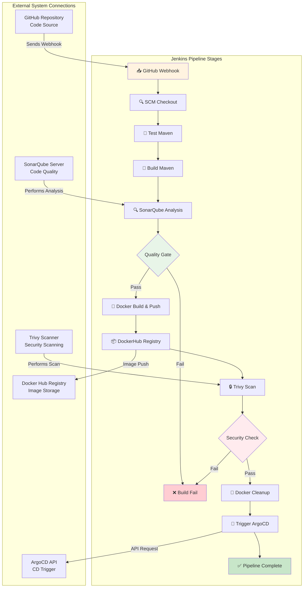
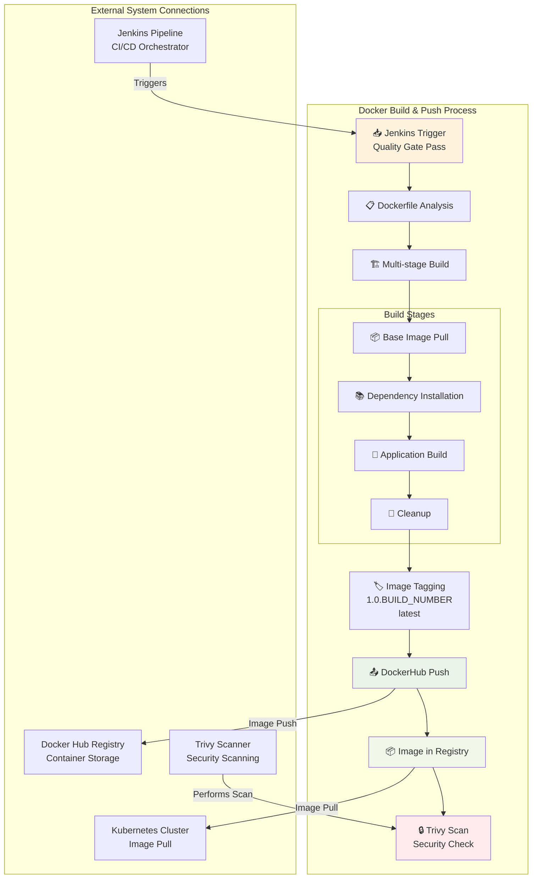
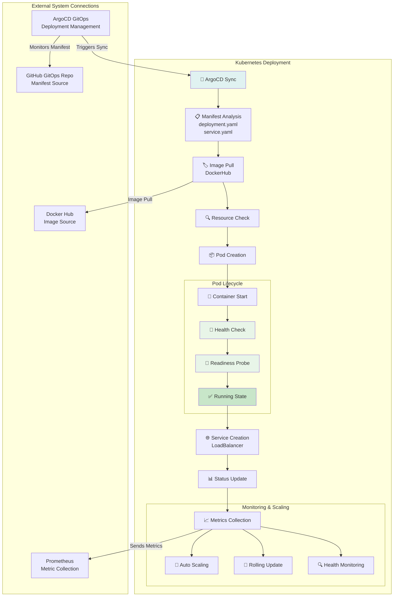
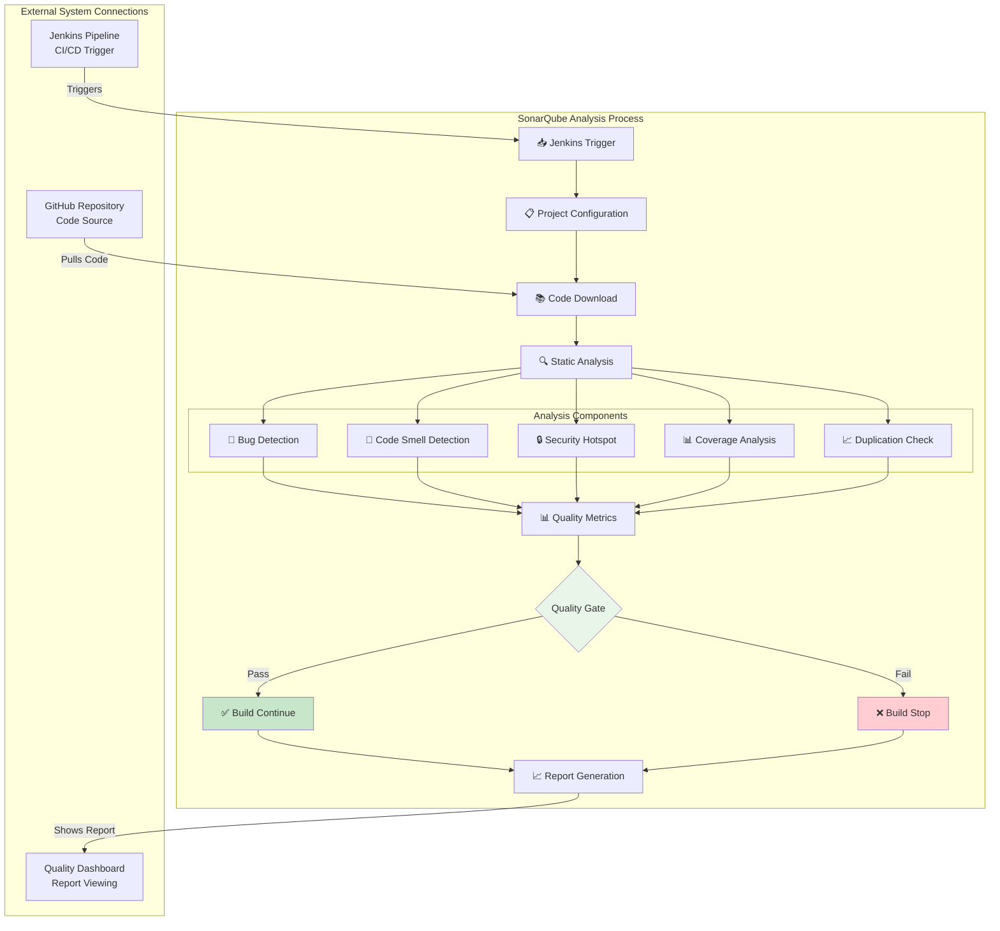
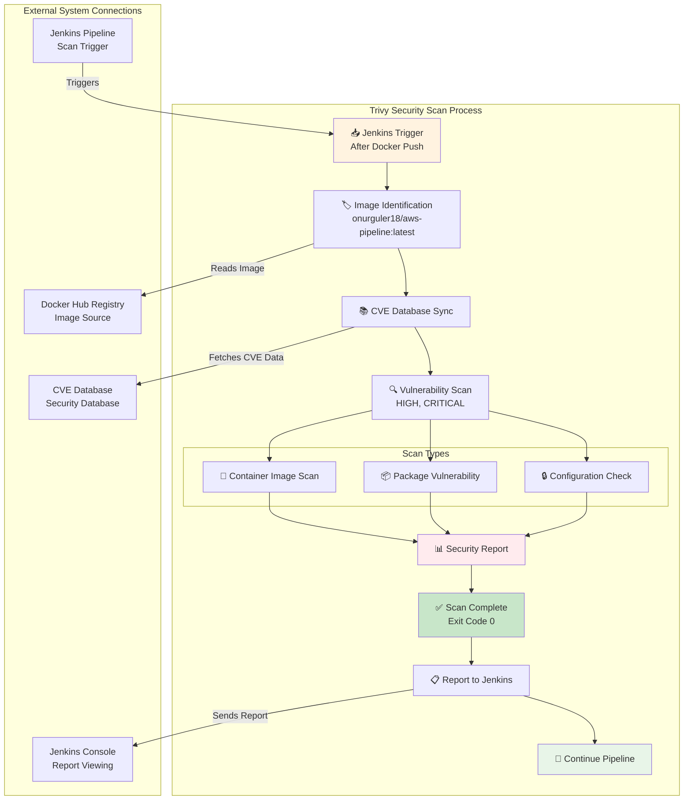
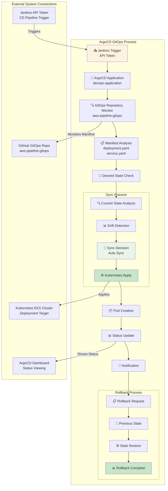
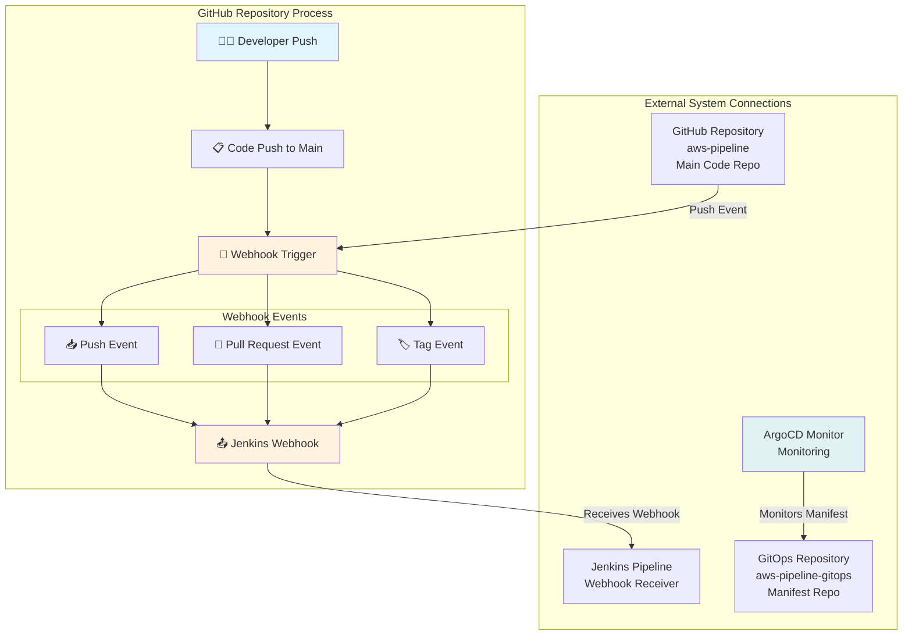
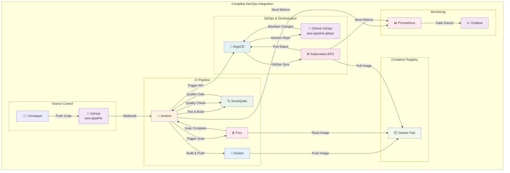
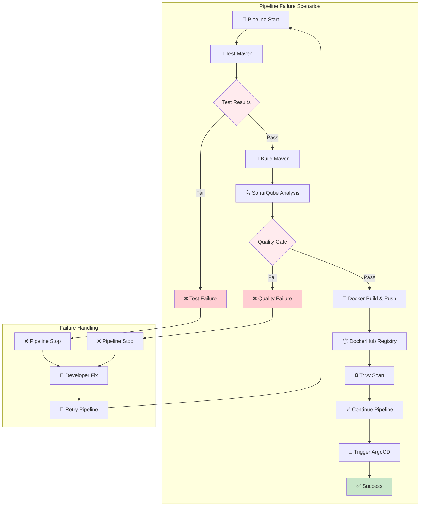

# Detailed DevOps Tool Diagrams

> **🇹🇷 Turkish Version:** [detailed-devops-diagrams.md](detailed-devops-diagrams.md)

## 🚀 Jenkins Detailed Process Diagram

## 🐳 Docker Detailed Process Diagram

## ⚙️ Kubernetes Detailed Process Diagram

## 🔍 SonarQube Detailed Process Diagram

## 🔒 Trivy Detailed Process Diagram

## 🔄 ArgoCD Detailed Process Diagram

## 🌐 GitHub Detailed Process Diagram

## 📊 Complete Integration Detail Diagram

## 🔄 Pipeline Fail Scenarios Diagram

