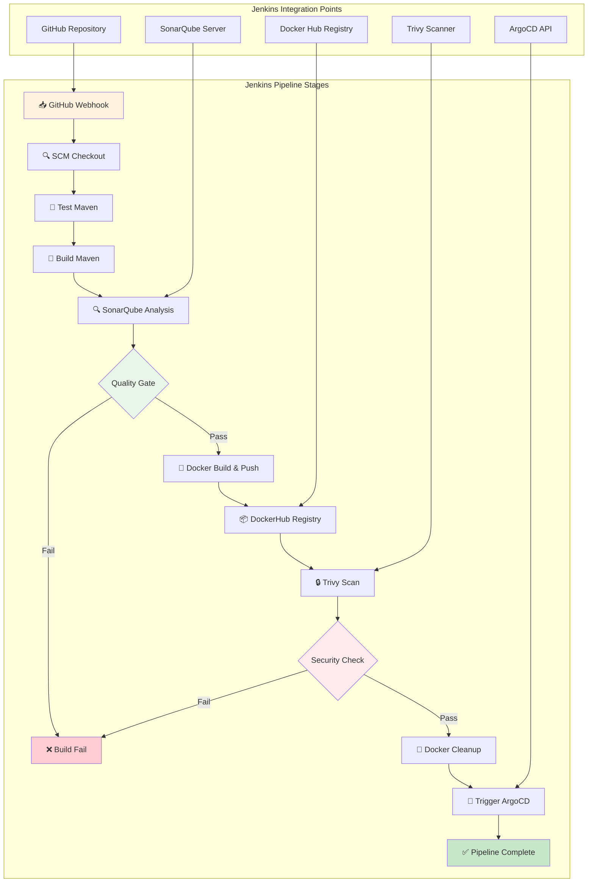
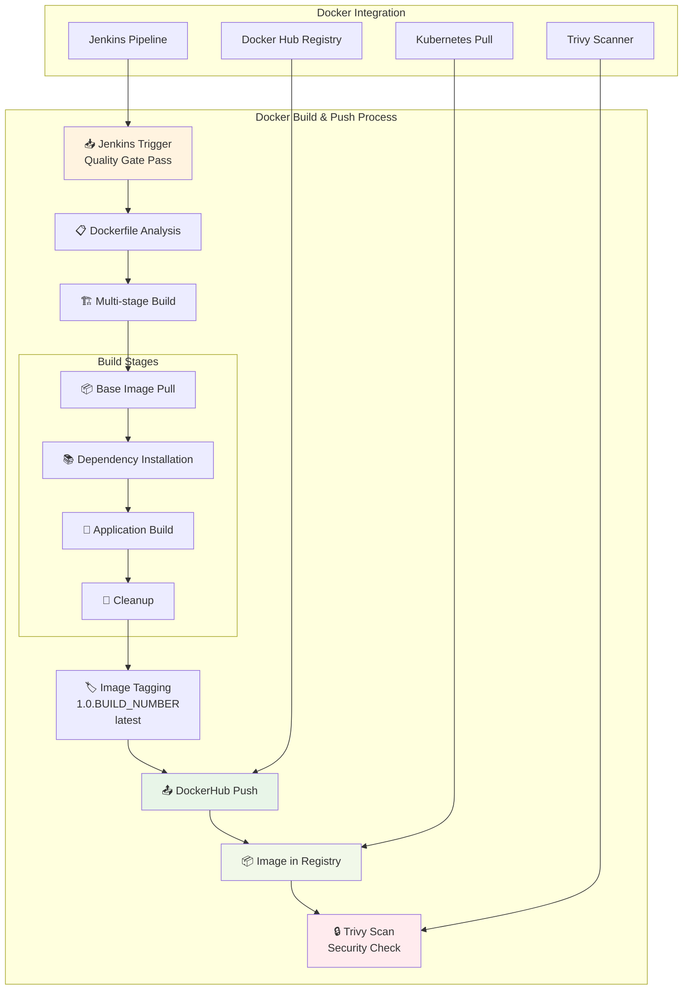
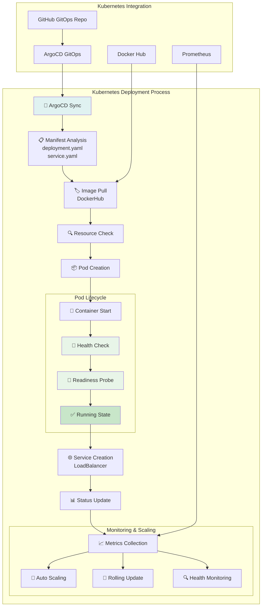
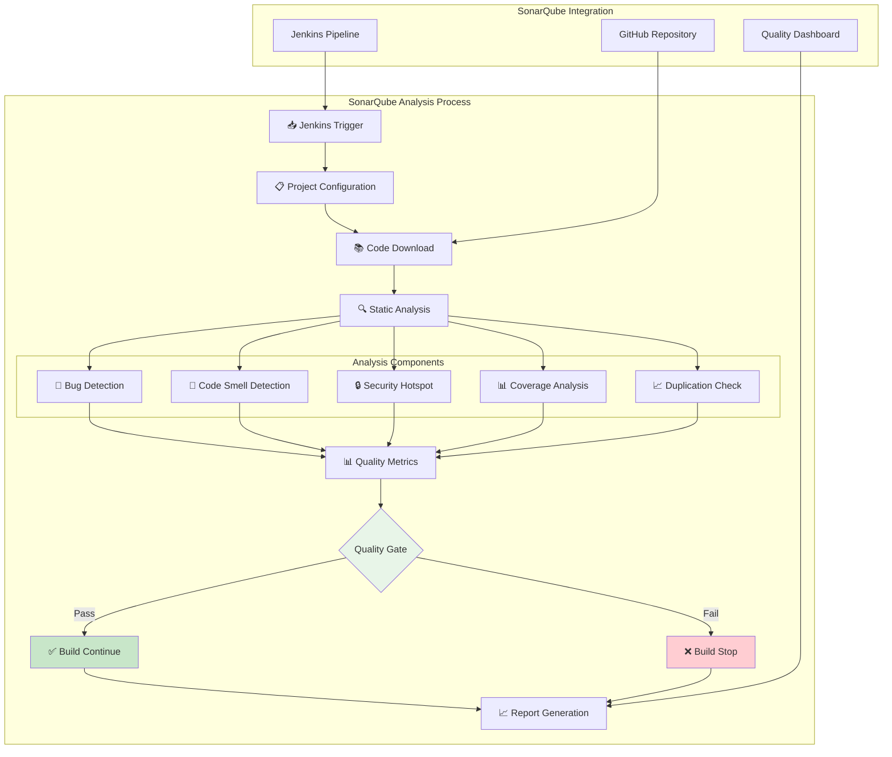
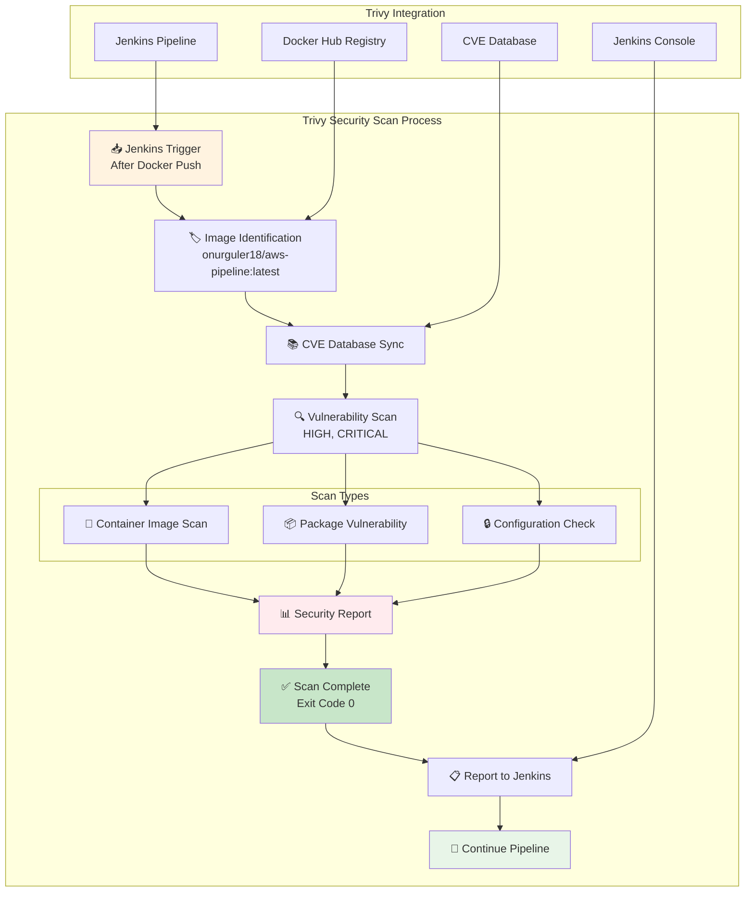
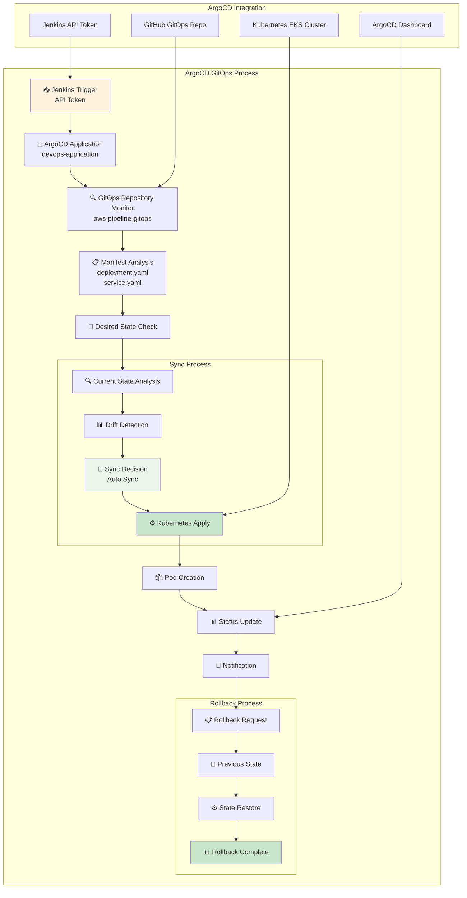
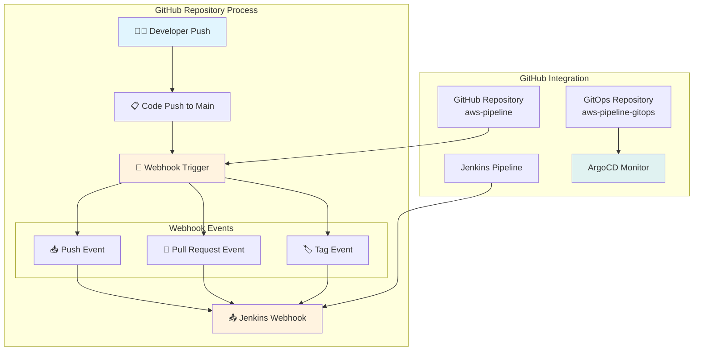
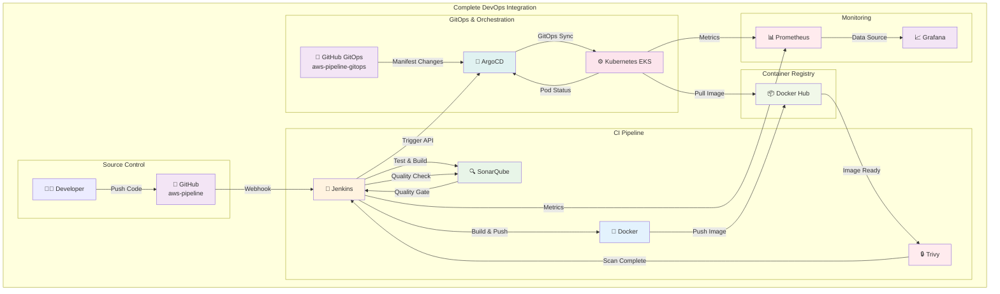
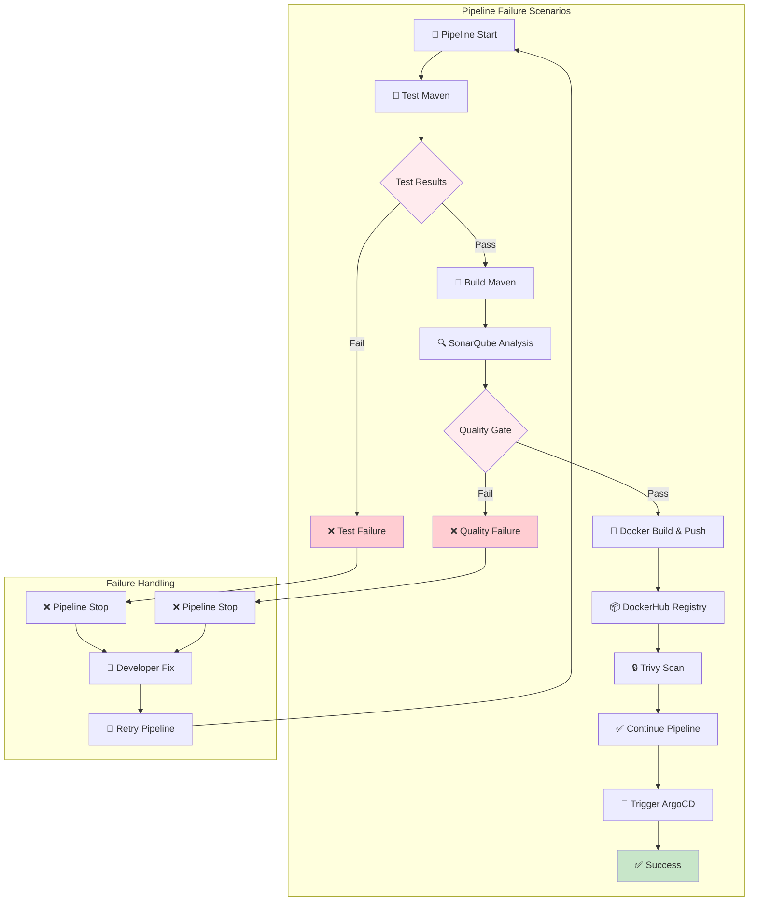

# Detaylı DevOps Araç Diyagramları

## 🚀 Jenkins Detaylı Süreç Diyagramı

## 🐳 Docker Detaylı Süreç Diyagramı

## ⚙️ Kubernetes Detaylı Süreç Diyagramı

## 🔍 SonarQube Detaylı Süreç Diyagramı

## 🔒 Trivy Detaylı Süreç Diyagramı

## 🔄 ArgoCD Detaylı Süreç Diyagramı

## 🌐 GitHub Detaylı Süreç Diyagramı

## 📊 Tam Entegrasyon Detay Diyagramı

## 🔄 Pipeline Fail Scenarios Diyagramı

