# Detaylı DevOps Araç Diyagramları

## 🚀 Jenkins Detaylı Süreç Diyagramı

## 🐳 Docker Detaylı Süreç Diyagramı

## ⚙️ Kubernetes Detaylı Süreç Diyagramı

## 🔍 SonarQube Detaylı Süreç Diyagramı

```mermaid
graph TB
    subgraph "SonarQube Analysis Process"
        A[📥 Jenkins Trigger] --> B[📋 Project Configuration]
        B --> C[📚 Code Download]
        C --> D[🔍 Static Analysis]
        
        subgraph "Analysis Components"
            D1[🐛 Bug Detection]
            D2[💨 Code Smell Detection]
            D3[🔒 Security Hotspot]
            D4[📊 Coverage Analysis]
            D5[📈 Duplication Check]
        end
        
        D --> D1
        D --> D2
        D --> D3
        D --> D4
        D --> D5
        
        D1 --> E[📊 Quality Metrics]
        D2 --> E
        D3 --> E
        D4 --> E
        D5 --> E
        
        E --> F{Quality Gate}
        F -->|Pass| G[✅ Build Continue]
        F -->|Fail| H[❌ Build Stop]
        
        G --> I[📈 Report Generation]
        H --> I
    end
    
    subgraph "SonarQube Integration"
        J[Jenkins Pipeline] --> A
        K[GitHub Repository] --> C
        L[Quality Dashboard] --> I
    end
    
    style F fill:#e8f5e8
    style G fill:#c8e6c9
    style H fill:#ffcdd2
```

## 🔒 Trivy Detaylı Süreç Diyagramı

## 🔄 ArgoCD Detaylı Süreç Diyagramı

```mermaid
graph TB
    subgraph "ArgoCD GitOps Process"
        A[📥 GitHub Webhook] --> B[🔍 Repository Monitoring]
        B --> C[📋 Manifest Analysis]
        C --> D[🔄 Desired State Check]
        
        subgraph "Sync Process"
            D1[🔍 Current State Analysis]
            D2[📊 Drift Detection]
            D3[🔄 Sync Decision]
            D4[⚙️ Kubernetes Apply]
        end
        
        D --> D1
        D1 --> D2
        D2 --> D3
        D3 --> D4
        
        D4 --> E[📊 Status Update]
        E --> F[🔔 Notification]
        
        subgraph "Rollback Process"
            G[📋 Rollback Request] --> H[🔄 Previous State]
            H --> I[⚙️ State Restore]
            I --> J[📊 Rollback Complete]
        end
        
        F --> G
    end
    
    subgraph "ArgoCD Integration"
        K[GitHub Repository] --> A
        L[Kubernetes Cluster] --> D4
        M[Jenkins Pipeline] --> F
        N[ArgoCD Dashboard] --> E
    end
    
    style D3 fill:#e8f5e8
    style D4 fill:#c8e6c9
    style J fill:#c8e6c9
```

## 🌐 GitHub Detaylı Süreç Diyagramı

```mermaid
graph TB
    subgraph "GitHub Repository Process"
        A[👨‍💻 Developer Push] --> B[📋 Code Validation]
        B --> C[🔍 Branch Protection]
        C --> D[📊 Pull Request]
        
        subgraph "PR Process"
            D1[🔍 Code Review]
            D2[🧪 CI Checks]
            D3[✅ Approval]
            D4[🔄 Merge]
        end
        
        D --> D1
        D1 --> D2
        D2 --> D3
        D3 --> D4
        
        D4 --> E[🚀 Webhook Trigger]
        
        subgraph "Webhook Events"
            E1[📥 Push Event]
            E2[🔄 Pull Request Event]
            E3[🏷️ Tag Event]
            E4[🔀 Branch Event]
        end
        
        E --> E1
        E --> E2
        E --> E3
        E --> E4
        
        E1 --> F[📤 Jenkins Notification]
        E2 --> F
        E3 --> F
        E4 --> F
    end
    
    subgraph "GitHub Integration"
        G[Jenkins Webhook] --> F
        H[SonarQube Integration] --> D2
        I[ArgoCD Monitoring] --> E
        J[GitHub Actions] --> D2
    end
    
    style C fill:#e8f5e8
    style D3 fill:#c8e6c9
    style F fill:#fff3e0
```

## 📊 Tam Entegrasyon Detay Diyagramı

```mermaid
graph TB
    subgraph "Complete DevOps Integration"
        subgraph "Source Control"
            GH[📁 GitHub]
            DEV[👨‍💻 Developer]
        end
        
        subgraph "CI/CD Pipeline"
            J[🚀 Jenkins]
            SQ[🔍 SonarQube]
            T[🔒 Trivy]
            D[🐳 Docker]
        end
        
        subgraph "Container Registry"
            DH[📦 Docker Hub]
        end
        
        subgraph "Orchestration"
            K[⚙️ Kubernetes]
            A[🔄 ArgoCD]
        end
        
        subgraph "Monitoring"
            M[📊 Monitoring]
            L[📋 Logging]
        end
    end
    
    DEV -->|Push Code| GH
    GH -->|Webhook| J
    J -->|Quality Check| SQ
    J -->|Security Scan| T
    J -->|Build Image| D
    D -->|Push Image| DH
    J -->|Deploy| K
    DH -->|Pull Image| K
    GH -->|Git Changes| A
    A -->|Sync| K
    K -->|Status| A
    A -->|Notification| J
    K -->|Metrics| M
    K -->|Logs| L
    
    style GH fill:#f3e5f5
    style J fill:#fff3e0
    style SQ fill:#e8f5e8
    style T fill:#ffebee
    style D fill:#e3f2fd
    style DH fill:#f1f8e9
    style K fill:#fce4ec
    style A fill:#e0f2f1
    style M fill:#fff8e1
    style L fill:#f3e5f5
```

## 🔄 Pipeline Fail Scenarios Diyagramı

```mermaid
graph TB
    subgraph "Pipeline Failure Scenarios"
        A[🚀 Pipeline Start] --> B[🧪 Unit Tests]
        B --> C{Test Results}
        C -->|Pass| D[🔍 SonarQube]
        C -->|Fail| E1[❌ Test Failure]
        
        D --> F{Quality Gate}
        F -->|Pass| G[🔒 Trivy Scan]
        F -->|Fail| E2[❌ Quality Failure]
        
        G --> H{Security Check}
        H -->|Pass| I[🐳 Docker Build]
        H -->|Fail| E3[❌ Security Failure]
        
        I --> J[📤 Docker Push]
        J --> K[⚙️ K8s Deploy]
        K --> L[🔄 ArgoCD Sync]
        L --> M[✅ Success]
    end
    
    subgraph "Failure Handling"
        E1 --> N1[📧 Test Notification]
        E2 --> N2[📧 Quality Notification]
        E3 --> N3[📧 Security Notification]
        
        N1 --> O[🔧 Developer Fix]
        N2 --> O
        N3 --> O
        
        O --> P[🔄 Retry Pipeline]
        P --> A
    end
    
    style C fill:#ffebee
    style F fill:#ffebee
    style H fill:#ffebee
    style E1 fill:#ffcdd2
    style E2 fill:#ffcdd2
    style E3 fill:#ffcdd2
    style M fill:#c8e6c9
```

