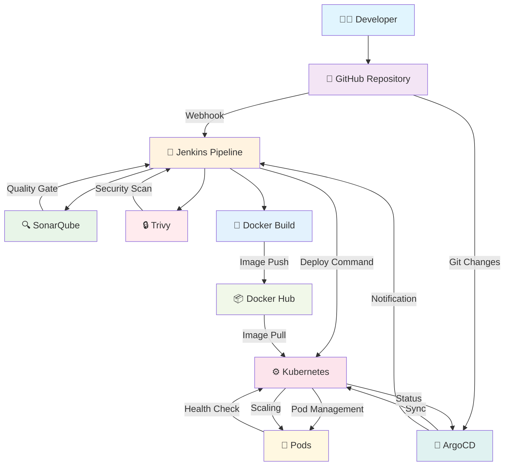
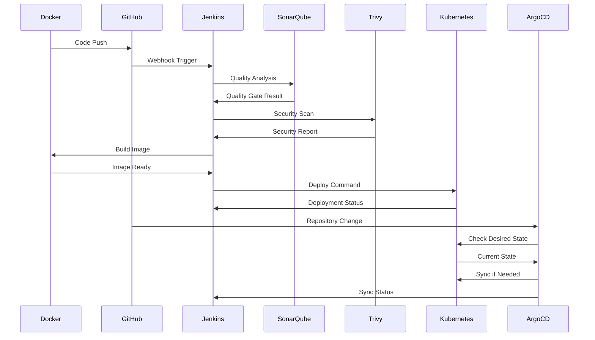
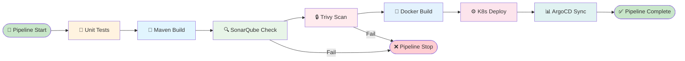

# DevOps Workflow Diagram

## Araçlar Arası Entegrasyon Diyagramı

```mermaid
graph TB
    Dev[👨‍💻 Developer] --> GH[📁 GitHub Repository]
    GH -->|Webhook| J[🚀 Jenkins Pipeline]
    
    J --> SQ[🔍 SonarQube]
    J --> T[🔒 Trivy]
    J --> D[🐳 Docker Build]
    
    SQ -->|Quality Gate| J
    T -->|Security Scan| J
    D -->|Image Push| DH[📦 Docker Hub]
    
    J -->|Deploy Command| K[⚙️ Kubernetes]
    DH -->|Image Pull| K
    K -->|Pod Management| P[🏃 Pods]
    
    GH -->|Git Changes| A[🔄 ArgoCD]
    A -->|Sync| K
    K -->|Status| A
    A -->|Notification| J
    
    P -->|Health Check| K
    K -->|Scaling| P
    
    style Dev fill:#e1f5fe
    style GH fill:#f3e5f5
    style J fill:#fff3e0
    style SQ fill:#e8f5e8
    style T fill:#ffebee
    style D fill:#e3f2fd
    style DH fill:#f1f8e9
    style K fill:#fce4ec
    style A fill:#e0f2f1
    style P fill:#fff8e1
```

## Jenkins-ArgoCD Entegrasyon Detayı

```mermaid
sequenceDiagram
    participant D as Developer
    participant GH as GitHub
    participant J as Jenkins
    participant SQ as SonarQube
    participant T as Trivy
    participant D as Docker
    participant K as Kubernetes
    participant A as ArgoCD
    
    D->>GH: Code Push
    GH->>J: Webhook Trigger
    J->>SQ: Quality Analysis
    SQ->>J: Quality Gate Result
    J->>T: Security Scan
    T->>J: Security Report
    J->>D: Build Image
    D->>J: Image Ready
    J->>K: Deploy Command
    K->>J: Deployment Status
    GH->>A: Repository Change
    A->>K: Check Desired State
    K->>A: Current State
    A->>K: Sync if Needed
    A->>J: Sync Status
```

## Pipeline Akış Diyagramı

```mermaid
flowchart LR
    Start([🚀 Pipeline Start]) --> Test[🧪 Unit Tests]
    Test --> Build[🔨 Maven Build]
    Build --> Quality[🔍 SonarQube Check]
    Quality --> Security[🔒 Trivy Scan]
    Security --> Docker[🐳 Docker Build]
    Docker --> Deploy[⚙️ K8s Deploy]
    Deploy --> Monitor[📊 ArgoCD Sync]
    Monitor --> End([✅ Pipeline Complete])
    
    Quality -->|Fail| Stop([❌ Pipeline Stop])
    Security -->|Fail| Stop
    
    style Start fill:#c8e6c9
    style End fill:#c8e6c9
    style Stop fill:#ffcdd2
    style Test fill:#fff3e0
    style Build fill:#e1f5fe
    style Quality fill:#e8f5e8
    style Security fill:#ffebee
    style Docker fill:#e3f2fd
    style Deploy fill:#fce4ec
    style Monitor fill:#e0f2f1
```
